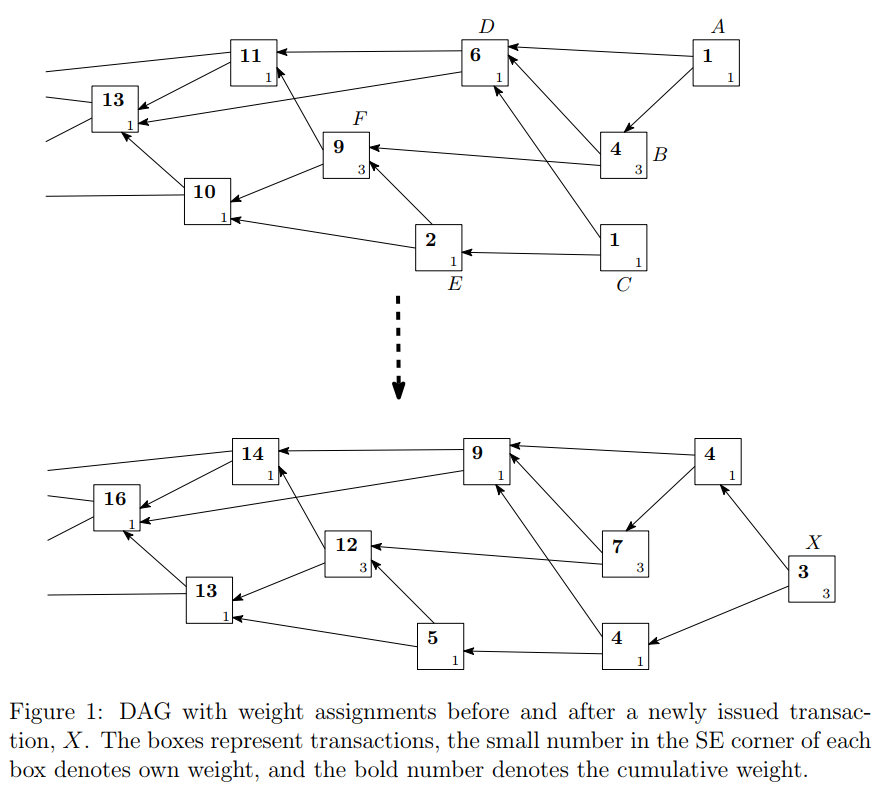
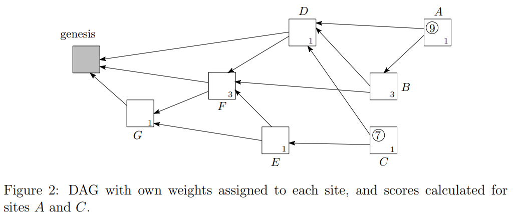

# IOTA
* * *

為IOT產業所生的虛擬幣，其亮點為交易保障架構為Tangle架構並非一般傳統的區塊鏈技術。

## Section.1
* * *

使用DAG(有向無環圖)來儲存交易資料，且支援 machine-to-machine micropayment。 

在過去六年中BTC已經證明區塊鍊已經是一個可以用於真實的技術，然而區塊鍊卻也存在著一些缺點。
其中一項缺點是不管多少量的交易都必須要扣除手續費，然而微量交易(micropayment)將會大量地存在於IOTA產業，而龐大的手續費會是令人非常煩惱的。
但是要從區塊鍊中拔掉手續費是非常困難的，因為區塊鍊技術需要礦工來創造出新的block，而手續費就會做為獎勵。
所以我們若需要去除手續費，我們必須使用有別於區塊鍊的技術。 
 
所以Tangle使用DAG來儲存交易的資料。每筆由節點所發起的交易會交織出一張tangle graph，而這就是blockchain中的帳本(ledger)。
而節點的邊(edge set)會由以下方法來取得： 
當一個新的交易進入tangle graph時，必須認可(approves)前兩筆交易，而這在圖形中會使用directed edge來表示。(如圖1) 
若A到B點沒有directed edge，但A到B點有directed path且edge數至少有兩個時，我們會說A indirectly approves B。
且會有一個「初始節點」(genesis)被所有的其他節點所approves 或是 indirectly approves。 
### 初始節點定義
> 在最初的tangle graph時，會有一個地址是帶有一個含有所有token的balance。 初始交易時會把這些token發送給其他創立者的地址裡。

### tokens
> 所有的tokens在一開始就會被創立並存於genesis裡，並不會再創造新的token，因此不會有通貨膨脹的問題。 也不會有礦工的概念。

### 名詞定義
> **sites** : tangle graph中的交易 
> **nodes** : 組成tangle graph，為發起跟認可交易的實體(entities)

### Tangle的最主要概念為： 
若要發起交易，使用者必須去認可(approve)其他交易。這將驗證的工作交給了使用者，使用者必須為網絡的安全做出貢獻。 
如果使用者發現了衝突交易他必須不認可(not approve)該項交易，不管是direct或是indirect的交易。 
若使用者認可了衝突的交易(conflicting transaction)，則他必須承擔被其他人拒絕認可自己交易的風險。  

一個交易若得到不只一個認可，他就會被系統接受為有更高的可信任度。換句話說，系統要接受[double-spending trandaction](https://en.wikipedia.org/wiki/Double-spending)是有一定難度的。 

重要的是，我們並不會強定任何規定關於交易如何挑選要認可(approve)的目標。 
取而代之的是，我們主張如果大部分的節點參照某種選擇協定，那最好有任何固定數目的節點是使用相同的方法。 
 
### 若要發起一則交易：
1.  節點必須要選擇另外兩個節點來透過一個演算法決定是否認可他們。通常來說，這兩個節點可能會同時發生。
2.  節點必須要確認這兩個節點是否含有衝突(conflicting)，若有衝突則不能認可他們。
3.  對於發起合法交易的節點，他需要解密一個值就像BTC blockchain一樣。可以透過尋找一段包了nonce跟data的Hash中的nonce來達成。

另外重要的是iota網絡是非同步的。通常來說，節點是不需要看到一樣的graph。
而conflicting transaction也是可以接受存在於graph的。
節點們不需要一致於哪些交易是有權力留在帳本裡的，也就代表說所有交易都可能會在帳本裡。
但如果有衝突交易在帳本裡時，節點必須要決定哪個交易會被孤立化(orphaned)。 

### 名詞定義
> **orphaned** : 該交易不會再被任何新的交易indirect approved。 

##  Section.2 Weights and more
* * *
在這個section會定義交易的權重跟相關的理論。交易的權重是與其參與的工作量成正比的。
目前線上的權重值只能為3^n，且n為介於一定區間的正整數。
事實上，了解權重的算法是沒有意義的，只要知道的是所有的交易都有帶有一個正整數的權重值。
通常來說，具有較大權重的交易是比較重要的。
且

 
#### 圖<1>
* * *

#### 圖<2>
* * *

