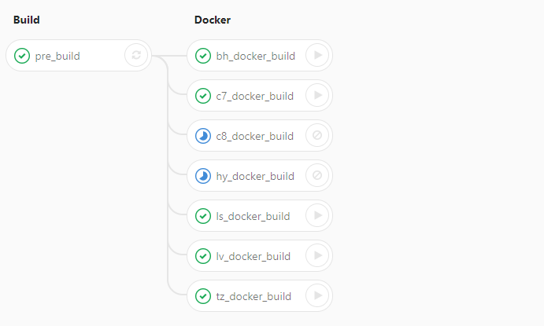

## GitLab CI 缺點
* * *
目前gitlab ci的Job設計無法非常客製化，主要概念依舊是一個pipeline可以有許多不同的stage，每個stage裡面都可有許多的Job。而我們可以設計Job的image跟他要進行的scripts等，但無法針對特定的Job做相依性的設計。 
例如：現在Stage1有Job1跟Job2，Stage2有Job3。我們無法去設定說Job3只相依於Job1，當Job1完成時Job3才被觸發。因為這個概念在gitlab ci目前是不存在的，可能必須要等到之後的版本才能有更細微的設定。

## 解決辦法
* * *
目前遇到的問題是一個project必須要build出七項不同的建置，每項建置都必須要搬移特定檔案。 
這次的解法是，我們將所有建置會遇到的一樣流程先做出一個stage，在下一個stage之後我們才去讓使用者選擇要建置哪種項目。
