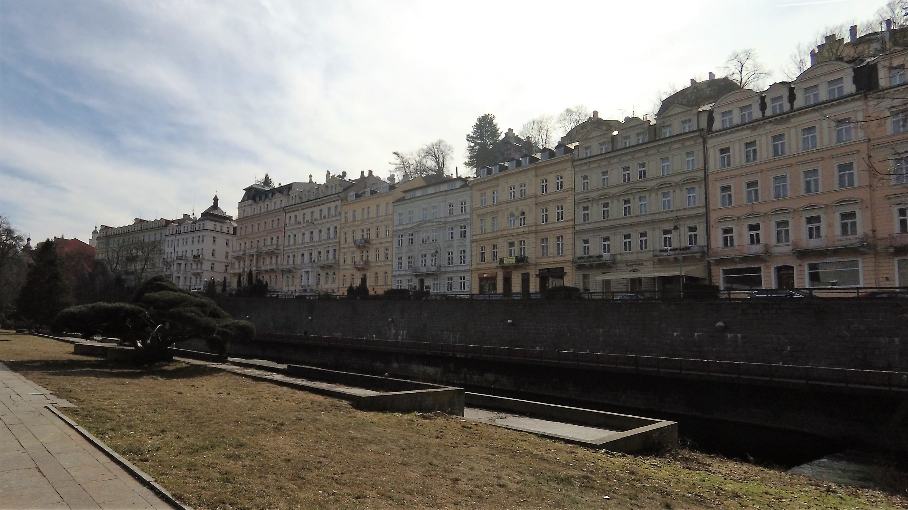
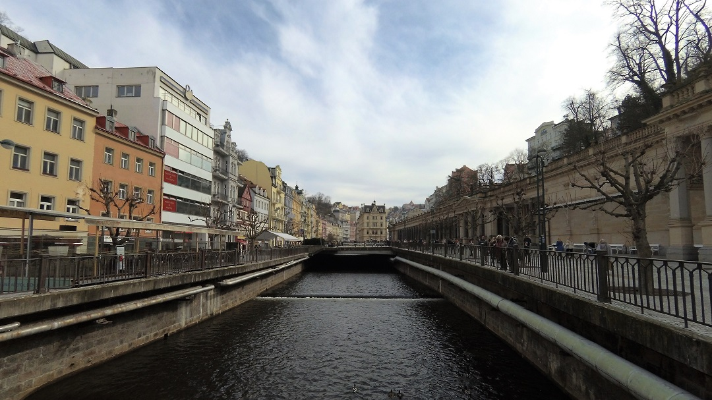
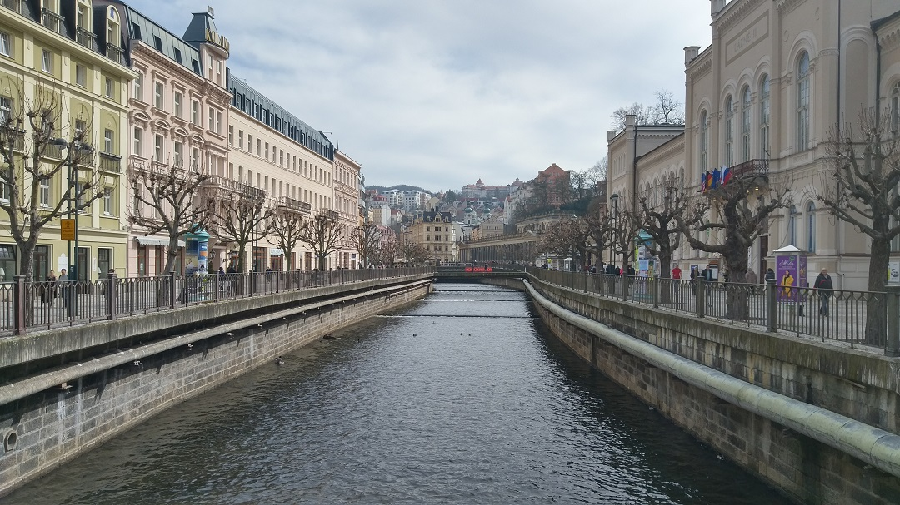
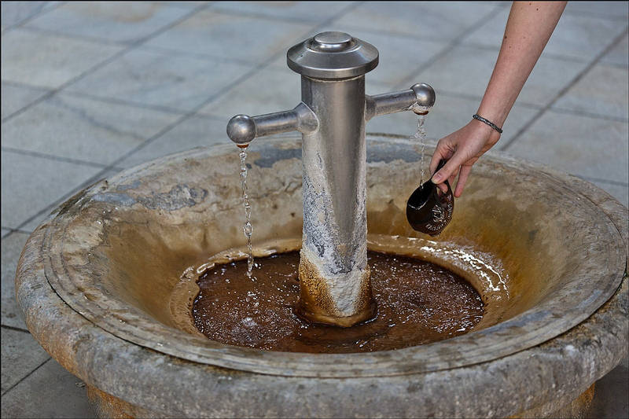

## 傳說中的溫泉小鎮
* * *
美好的星期日早上搭著Student Agency的巴士噗噗的就來到了開學時朝思暮想的溫泉小鎮。這小鎮依舊是典型的歐洲小鎮，到處都有漂亮的建築。特別的是整個小鎮的主要景點都沿著一條河往上貫穿，順著河邊的路就能欣賞到這小鎮美麗。
 
 
沿著小河走就能看到許多美麗的建築。

沿著河的附近也能找到許多小溫泉出口，這樣的溫泉不是拿來洗手不是拿來泡腳，通通都是拿來喝的。

根據之前在城崎溫泉喝過溫泉水的經驗，對於這項舉動依然非常不解，感覺就是在喝滿滿金屬味的鹹水。真的只有難喝跟難喝，可是路上每人都是人手一杯，走路時不時啜飲一口，好似美酒在手中一樣怡然自得。又再一次佩服歐洲人的遲鈍味蕾。
 
這些溫泉水還能根據各自的喜好，選擇不同的據點跟水溫，每個據點的味道都不盡相同，而水溫則是越低越能喝出可怕的金屬味。但依然不變的就是，還是一樣難喝~
 
 
但溫泉水依然無法掩蓋這小鎮的美麗，而且小鎮盛行琉璃製品，有許多精美漂亮卻又不貴的玻璃裝飾品讓我都很想帶回家。但可惜怕在回台灣的路上全部碎光光，所以只好忍下自己的手跟錢包當好朋友。