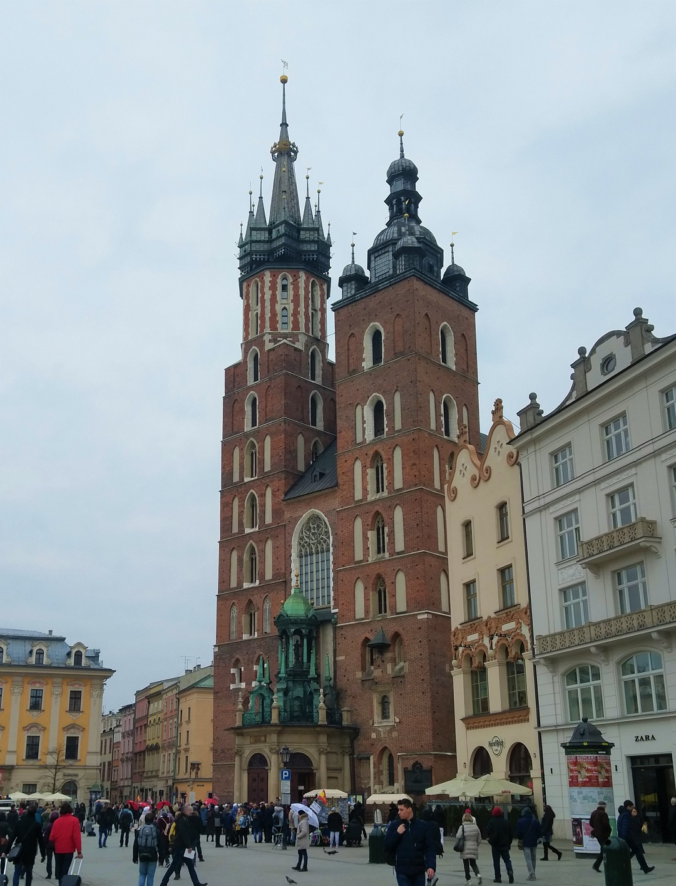
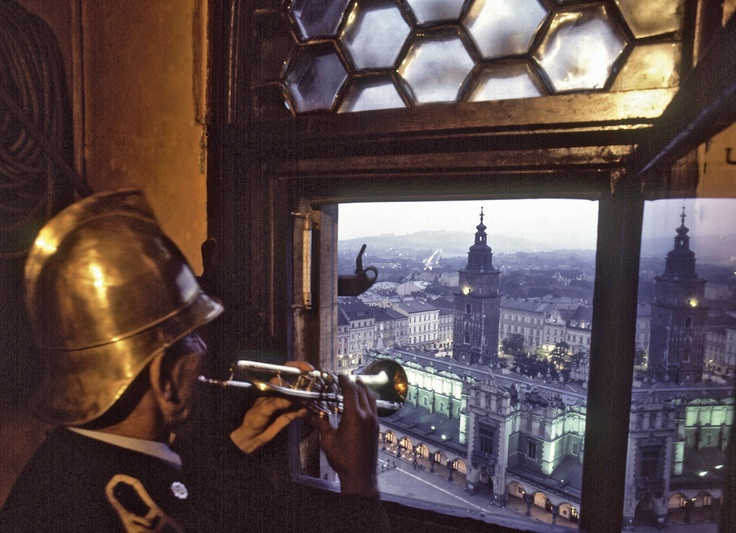
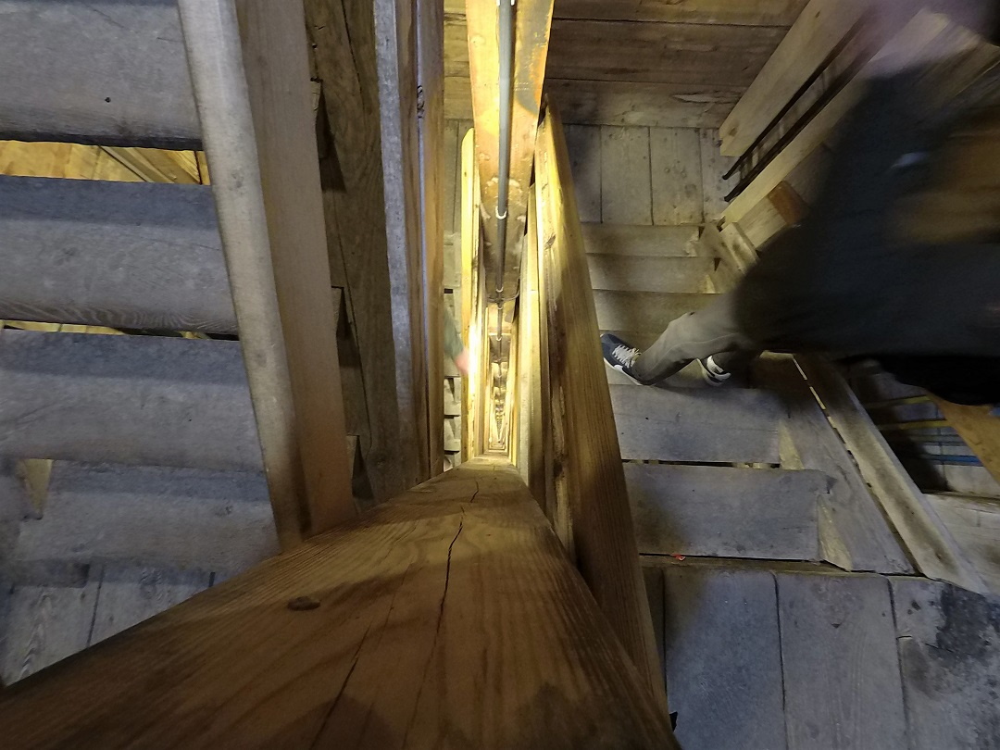
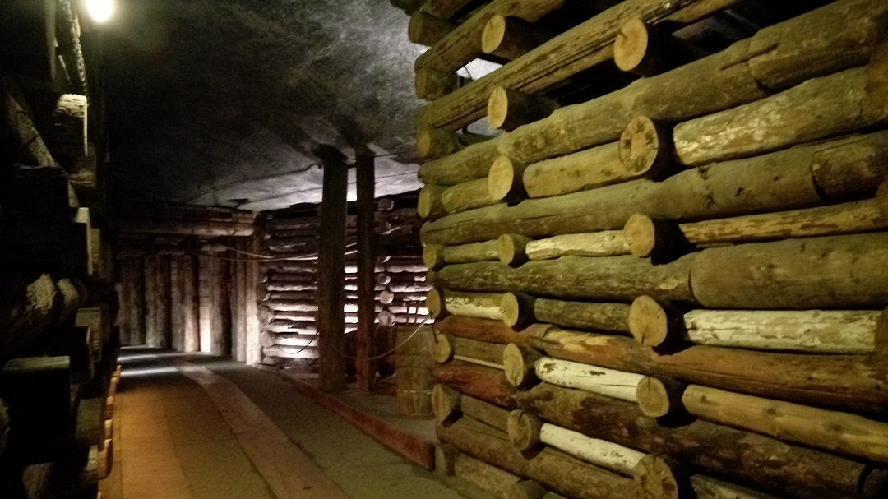
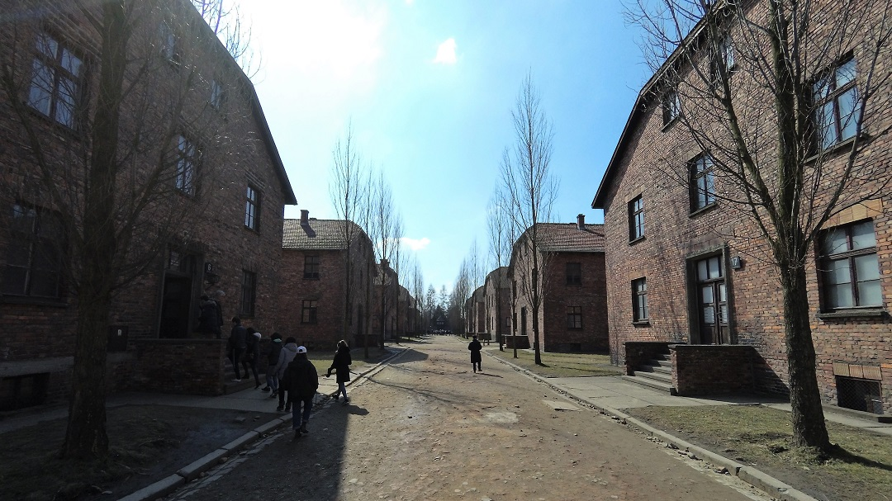
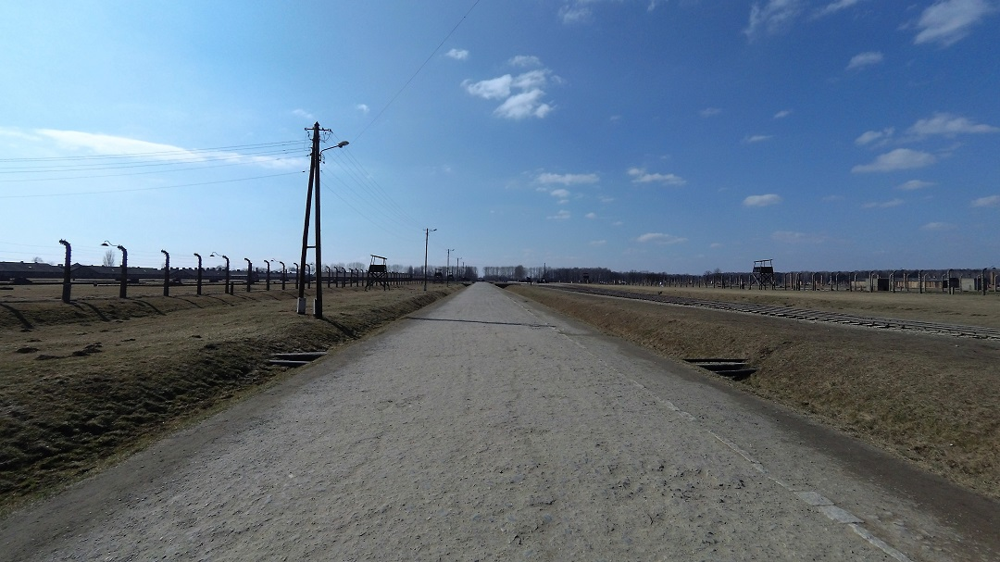
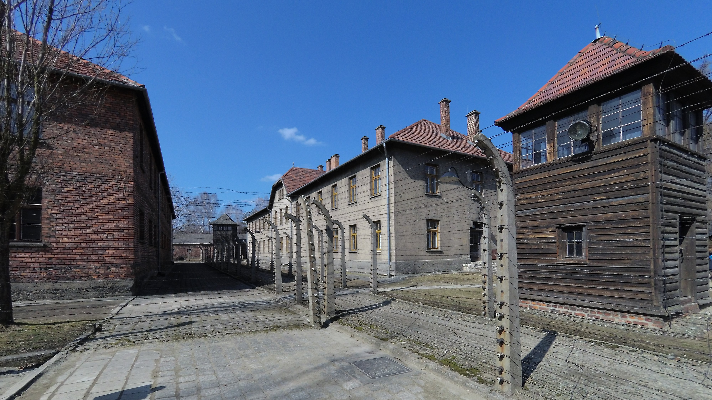

這次拍照都好醜所以封面照為[圖片支援](https://sumfinity.com/hdr-photos/poland/krakow/first-light-krakow-main-square-poland/)
## 四天波蘭舊首都 - Krakow
* * *
身為舊首都就好像暗示這個地方曾經是一片的輝煌卻逐漸沒落。不過波蘭的Krakow似乎不是如此，以前是如此的輝煌但現在卻也是非常非常重要的經濟與文化集散地，因此這裡的人常笑說華沙那種鬼地方別去啊~ 
波蘭腹地大部分都是平原缺乏天然的屏障，導致這個國家總是被其他國家侵略，例如二戰時的德國一開始就是瞄準這國家開刀，而在更早之前蒙古人更是曾經侵略此地。 
也因此在這個國家要蓋一個穩固又大又安全的城鎮是非常重要的事情，所以現在的整個古城區以前可是被巨大的城牆所包圍呢。而整個古城的中間不像是其他國家一樣是教堂而是菜市場(就是封面照的建築物)，對以前的波蘭人來說教堂可以等但買東西不行啊!買買買~ 
可憐的教堂就只好被晾在一旁了。

在教堂的左邊尖塔每個小時都會有一位小喇叭手對著古城的四個方位吹奏一段小曲，但是每一段都一定吹到一半就會斷掉。為什麼會吹一半就斷掉呢？該不會是小喇叭手想要早下班吧。其實只演奏到一半是有歷史淵源的，而這故事還跟當時攻打這裡的蒙古人有關呢。 
原本的小喇叭手其實是站哨的士兵，他的工作是要在整個城鎮的制高點也就是教堂的尖塔來監督是否有敵軍來襲。而就在那月黑風高的夜晚裡，蒙古人突然殺過來了!!盡責的小喇叭手拚了命的想要警告所有城鎮的人，而他也成功的把大家叫醒抵擋住蒙古人的來襲，但就在他吹奏到一半時就被蒙古人所射出的弓箭射殺死亡，導致喇叭聲颯然而止。而後人為了紀念這位盡責的哨兵，規定後來小曲都只能演奏到一半就要突然停止。

[圖片支援](https://www.pinterest.com/acpkilburn/poland/)

## 鹽礦
* * *
在Krakow東南方30分鐘車程有個支撐以前波蘭命脈的鹽礦，話說這鹽巴在古時候可是跟銀一樣的值錢，在許多地方都需要鹽巴，但是當時從海取得鹽巴的技術不夠成熟反而開採鹽礦才是正確又快速的鹽巴取得方法。 
這座鹽礦非常的巨大，在地下有九層，而隧道總長可是有將近200公里這麼多。當時要下去參觀時是用樓梯下去的，看到那樓梯的深度真的非常震撼。

鹽礦中的所有結構都由木頭來支撐，因為當時的煉鐵技術不發達，而鹽巴又能滲透進木材的隙縫中結晶讓木頭都更加得堅固跟耐用。參觀的時候其實很多的木頭都已經有好幾百年歷史了，但每根木頭都還是非常的牢固，支撐著這個鹽礦。

## 奧斯威辛集中營
* * *
波蘭在二戰的時候是全歐洲擁有最多猶太人居民的國家，再加上奧斯威辛地處東歐中心處，因此這裡蓋有三座集中營也是最多猶太人喪命的地方。歐洲各地的猶太人被納粹藉由鐵路送來這裡，路途中因為環境骯髒、食物不足導致許多人喪生，而能活著到集中營的猶太人要面對的卻是直接送往毒氣室或是勞役到死亡。

在入口處的招牌上寫了三個字「Arbeit Macht Frei」意思是「勞動換取自由」，看來格外諷刺。大部分來到這裡的猶太人都像是無頭蒼蠅一般不知道發生了什麼事，他們通常只被告知要在短時間內帶上25公斤的行李後就要離開熟悉的家園。 
下車後，猶太人會透過SS的肉眼鑑定立刻分出兩組人馬，一組是有勞動力的青壯年會被送去工作，而另一組就是沒有「利用」價值的老弱婦孺會直接被送進毒氣室裡。然而在此分散的人們只被告知老人小孩會被送去「洗澡」，而錯過了唯一可以跟家人說再見的機會。 

左右兩旁都是集中營的房子，猶太人將會在前方被「分類」

這幾座集中營都被作為人類歷史中最深的痛刺在奧斯威辛，讓所有之後的世世代代都能有所警惕曾經的傷痛。但是現在的以色列青少年在這裡就像野餐跟戶外教學一樣，不知道自己的族人在這裡被如何的對待。對於他們來說這裡就好像是另一個打卡聖地，所有人披著以色列國旗好似團結，卻是嬉皮笑臉。就像台灣的228事件一樣，現在的人已經忘記這個慘劇的發生，只知道228放假，要怎麼請假才能有更多連假可以出去玩。對於這放假的本質早已忘的一乾二淨、蕩然無存。

