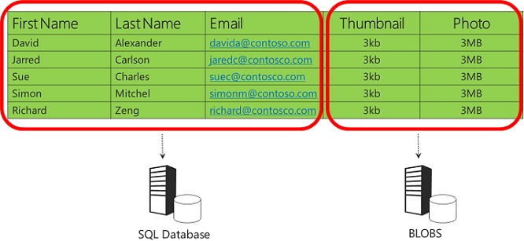
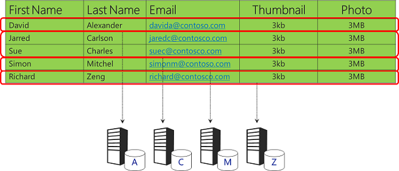

## 為何我們需要Sharding與Partition?
* * *
當table的資料量開始變的巨大導致我們在Join或是Query table的時候開始過多的時間，這時我們就需要優化我們table。其中最常見的方法就是將我們的table拆散，只要table變小那麼所需要搜尋的時間自然也會降低。而拆散table的方式也分為horizontal partitioning, vertical partitioning，這兩個方法我們用圖片就能很清楚地明白到底在做什麼事情。 
### Vertical Partition
* * *
將同table中不同的column拆散成不同的table。建議將有強相依性的column留在同一個table，如下圖作法是將與圖片相關的column(Thumbnail, Photo)拆至另外的table。

### Horizontal Partition
* * *
又稱作sharding，意思為將table用一些方法將不同的tuple拆散成不同的table裡面。在MySql中有像是range partition, key partition, hash partition等等，選擇適合的方法將tuples平均的分散至不同的table中。

## 會遇到的問題
* * *
1.  管理困難
    當有越多的table被sharding，整個資料庫的邏輯會非常難以理解。

2.  Query難以撰寫
    當資料庫邏輯難以理解的時候，Query的撰寫難度也回逐漸升高，出錯率也會大增。

所以我們當然會希望可以有個統一的窗口讓我們只去設定想要sharding的目標，讓窗口自動化的幫我們去實現資料庫背後的sharding邏輯。Query的撰寫也希望能自動化的去轉換成分布式，讓工程師可以快速又正確的撰寫Query。

## [Vitess](https://vitess.io/)
* * *
Vitess就是由Youtube團隊為了解決資料量龐大、邏輯複雜導致Query的錯誤率升高，讓Youtube工程團隊有解不完的Bug、加不完的班。又幸好當時寫這套前端窗口的人致力開源這份程式碼，才讓後世的人能不用辛苦地寫一份這種可怕的東西(我想也沒多少人寫得出來)。