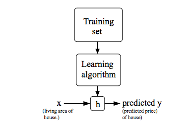

菜雞學ML

## 監督式學習(Supervised Learning)
* * *
對於dataset已經有"正確的答案"了，目的要預測出正確的輸出。

```
Regression Problem : Predict Contious value problem
```

```
Classification Problem : Discrete value output(example:0 or 1)
```

## 非監督式學習(Unsupervised Learning)
* * *
沒有Label，試圖讓電腦分任別出dataset不同的結構。<br>
例如將有相關的新聞進行分類。

## Model Representation
* * *


```
h : hypothesis, 假設函數, 假設y = f(x) f就是h。
```

線性回歸函數。

## Cost Function
* * *
用來判斷hypotheses function是否準確。


這個是使用最小平方差來當作Cost Function。

## Gradient Descent
* * *
用來最小化函數(找出函數中y最靠近0的點)。

