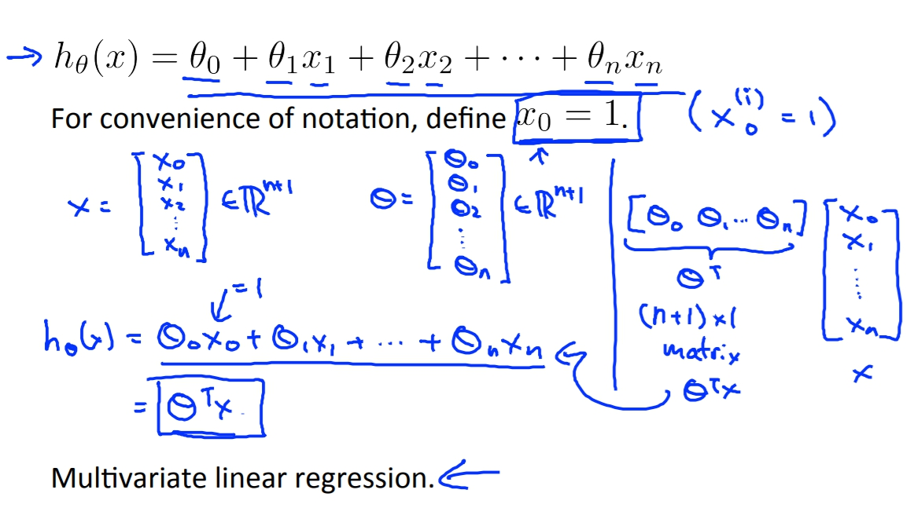
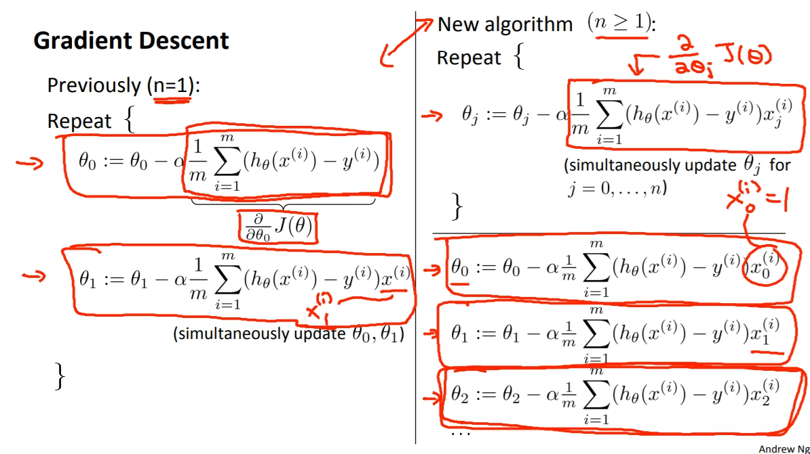
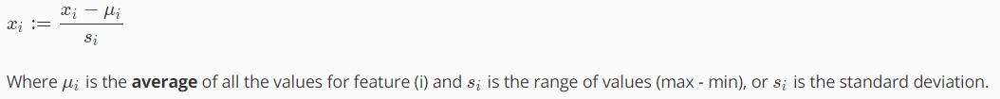
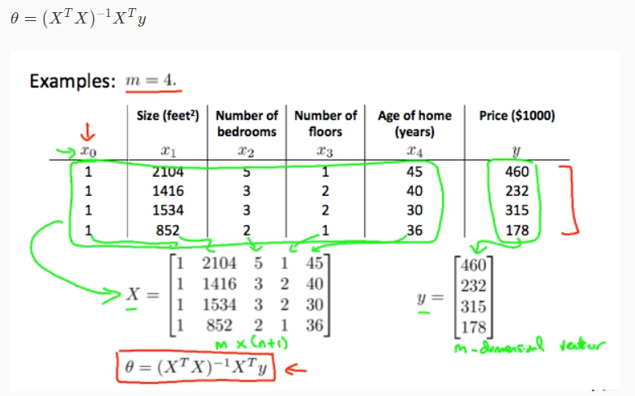

菜雞學ML

## Multiple features
* * *
Linear regression若有多數的特徵點(好幾個X)，原本的函數就要改一下。

而原本的Gradient Descent在Cost function上的函數也要做修改。

其實就是在最後要乘上X的地方做修改，原本偏微分只有X1，現在因為有很多特徵所以偏微分會有X1,X2...Xn。

## Feature Scaling(for gradient descent)
* * *
可以將特徵值作放大或縮小，以利收斂。 
讓特徵值都在-1 ≤ Xi ≤ 1是最好的。

## Mean normalization(for gradient descent)
* * *
讓平均數 = 0。

## Normal equation
* * *
很純粹的轉換就可以得到的結果。

