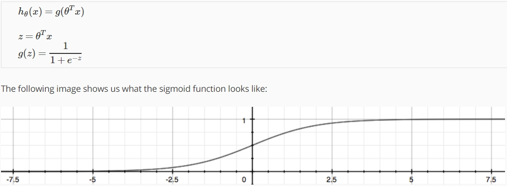

菜雞學ML

# Classification
* * *
## Logistic Regression-Hypothesis Representation
* * *
因為classification problem是屬於離散的value，我們無法用舊有的假設函數來配合這項輸出，所以我們需要新的假設函數。"Logistic Function"或稱作"Sigmoid Function"。


## Logistic Regression-Decision Boundary
* * *
我們可以將我們的Classification狀態分為。


而我們的logistic function當輸入大於0時就會得到大於0.5的值，使y = 1。

所以假設我們輸入logistic function的值是
的話：

<br><br>
則：


而 **Decision Boundary** 就是界定哪邊Y=1哪邊Y=0的界線，例如:


## Cost Function
* * *
如果我們套用原本Linear Regression的Cost Function的話會出現一個問題。那就是Cost Function是non-convex function代表說我們沒辦法用Gradient Descent去取得夠好的optima。

因此我們必須定義出新的Cost Function並讓新的Cost Function是Convex function。


### 簡化Cost Function


## Gradient Descent
* * *
再來我們需要做的就只是將Cost Function去做Gradient Descent求出最好的Theta解。
[Cost Function偏微分步驟在此](https://math.stackexchange.com/questions/477207/derivative-of-cost-function-for-logistic-regression)


## Advanced Optimization
* * *
除了Gradient Descent之外還有許多其他更加複雜但是收斂速度更快的Optimization Algorithm，像是"Conjugate gradient", "BFGS", and "L-BFGS"。然而要理解這些演算法會十分困難(有時間再看囉)，所以我們可以使用Octave或Matlab的fminunc來為我們自動選擇並使用這些演算法。<br><br>
首先我們必須將我們的CostFunction寫成下面這種output的function。
```matlab
function [jVal, gradient] = costFunction(theta)
  %jval是算出CostFunction的值
  jVal = [...code to compute J(theta)...];
  %gradient就是列出CostFunction每個theta的微分算出來的值
  gradient = [...code to compute derivative of J(theta)...];
end
```
<br><br>
再來就可以把值帶入matlab或是octave寫好的function中讓他幫我們找出theta。
```matlab
%GradObj on代表說我們有指定出Gradient函數出來。
options = optimset('GradObj', 'on', 'MaxIter', 100);
initialTheta = zeros(2,1);
   [optTheta, functionVal, exitFlag] = fminunc(@costFunction, initialTheta, options);
```


## Multiclass Classification
* * *
若我們有多種類別的話例如：陰天、晴天、雨天。這時候有個方法叫做One-vs-all，意思是當我們拿第一個種類訓練的時候例如陰天，我們把晴天和雨天都當作同一種指標，這樣我們會生成第一個Decision Boundary。我們之後再依序拿晴天和雨天做訓練，就會得出另外兩個Decision Boundary。這樣我們判別的時候我們就可以將X依序帶入三個g(z)來得出哪種天氣的機率最高。


