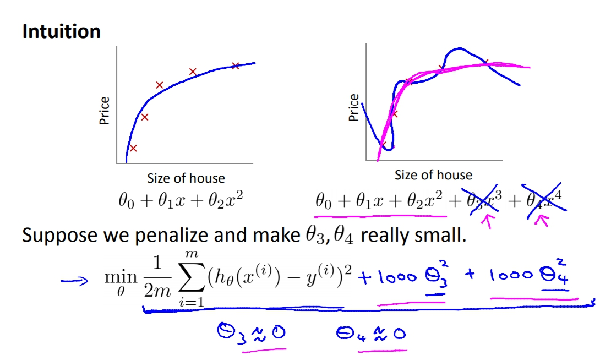

菜雞學ML

## Overfitting
* * *
當我們用太多的feature去取得假設函數的時候，可能會造成過度耦合的問題。 
導致在training set非常準，可是到預測的時候就會一蹋糊塗。

這時可以有兩種解決方式：
1. 減少features。
2. Regularization做正規化。

## Regularization
* * *
直觀的解釋就是，我們可以透過"懲罰"theta來得到更圓滑的曲線(像是右邊的桃紅色線)

所以Regulariztion所做的就是將theta都縮小，讓最後跑出來的曲線不會過度耦合。

這就是我們的正規化函數，它的作用就是將每個theta都平方相加在乘上Lambda(正規化參數)。
  
### 正規化參數 regularization parameter
它的作用就是平衡左邊原本的Cost Function以及右邊的正規化函數。 
若是Lambda太小就會造成Theta還是偏大，導致over fitting的問題繼續存在。 
但若Lambda太大就會造成Theta太小，假設函數變得太單調導致High bias(uderfit)的問題。

## Regularized Linear Regression
* * *

上面的Cost Function就是linear regression的Regularized Cost Function。 
那如果我們要做Gradient Descent的話該怎麼做呢? 
一樣是對Cost Function作微分，另外我們將theta(0)分開來寫，因為theta(0)所乘上的X(0)會一直是1所以我們不用懲罰他。而對剩下的Cost Function做微分就會是。因為微分好難，影片中也沒有解釋所以就這樣吧。

最後套上Gradient Descent的結果就會是如下。

## Regularized Nornal Equation
* * *
對Normal Equation做正規化只要加上一個矩陣L。

若原本的X^TX是不可逆的矩陣，在加了這個L之後也會變成可逆。

## Regularized Logistic Regression
* * *
跟Regularized Linear Regression差不多。一樣加入正規化函數。

