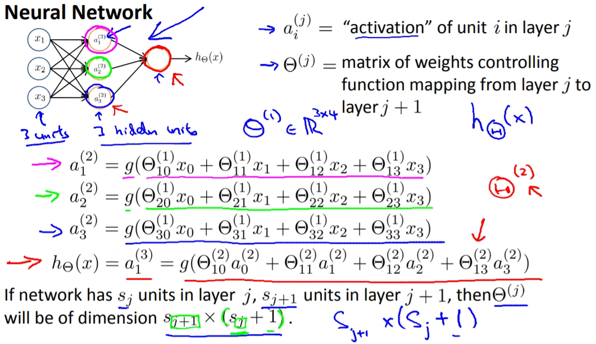

菜雞學ML

## Non-linear Classification
* * *
當資料不是以線性來去呈現的話，會導hypothesis function過度複雜且feature過多，導致Linear Regression過度緩慢。

所以我們需要另一種邏輯的方式去處理大量的feature資料。

## Neural Network
* * *
類神經網路最簡單的結構就是下圖，透過輸入X0 X1 X2 X3的輸入層，配合上每條線不同的權重Theta，就可以得出橘色的輸出層。

更廣的推演就如下圖。

## Forward Propagation
* * *
如果我們依照每個步驟。  
Step1: 拿取輸入值。 
Step2: 根據權重算出下一層的z。 
Step3: 把z帶進激活函數算出a，g(z) = a 
Step4: 拿算出的a，根據銓重算出再下一層的z 
... 
依序一直做到輸出層後，我們就可以算出最一開始X的預測值，這步驟也叫做**Forward Propagation**。

## Example: AND 與 OR閘
* * *
我們可以透過權重設定來做出簡易的AND跟OR邏輯。

也可以透過堆疊兩個Layer來做出更複雜的邏輯。

## Multiple outputs - one VS all
* * *
當輸出的情況不只一種呢，例如要在圖片中辨識出車子、人、房子等，我們就需要輸出值是一個矩陣。

這時候我們只要算出每個不同種類的東西的Hypothesis Function，當有新的物體出現時我們把他帶進各個種類的h(x)，看哪個種類的值最高，就當他是那種東西。

