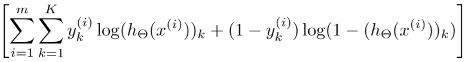
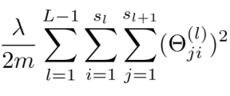
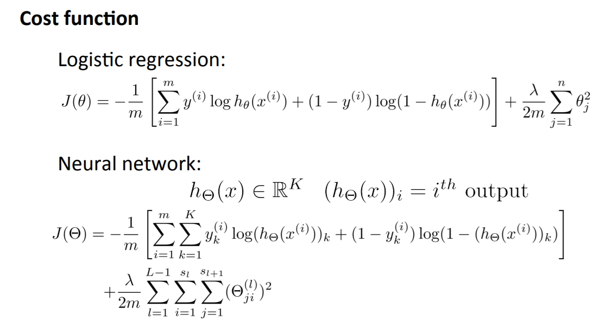
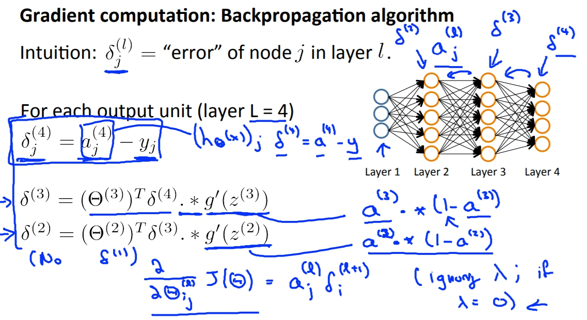
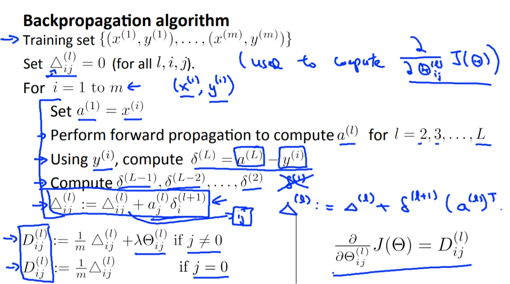
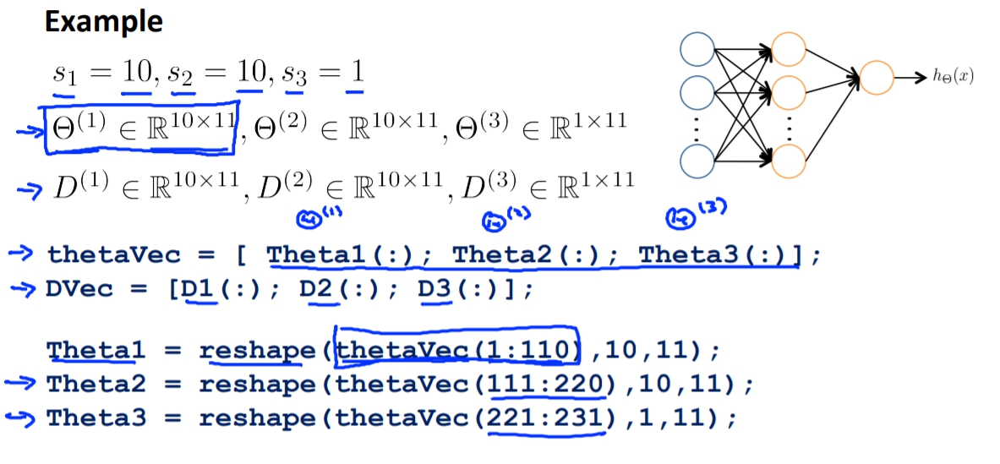
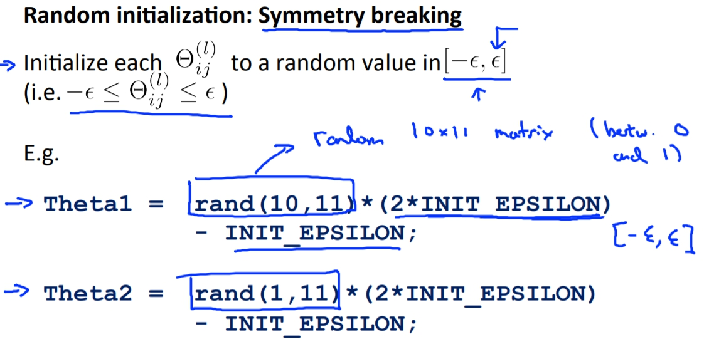

菜雞學ML

## Cost Function
* * *
當我們要訓練一個模型時，我們希望他的Cost Function能被我們找到最佳的Theta解，而Neural Network也是這麼一回事，我們必須先定義出他的Cost Function再將她帶入Optimiza Algorithm來求出最佳Theta解。
 
 
來稍微解釋解釋Cost Function，不然我看我以後也是看不懂。 
Neural Network用的Cost Function跟Logistic Regression的一樣，但是因為輸出可能是K outputs。所以我們要做的第一件事情就是，在Sum的地方新增加把所有輸出層的units都加在一起。

而Regulation的Theta也是要把Theta矩陣的所有Theta相加起來。 
最後的完成品就是下面。

## Gradient Computation
* * *
另外一個我們要湊齊的東西就是Cost Function的微分啊!!!沒有微分我們就沒辦法讓厲害的最佳化演算法算出好棒棒的結果。 
在得出微分前我們要先看一個東西那就是**Error**又稱Delta。Error簡單來說就是每個激勵函數出來的值與正確的值的偏差(應該是這樣吧)。 
所以在輸出層的算法很簡單，純粹就是a - y。可是一到隱藏層，就難到靠北，不過butしかし只要懂概念就好，因為再來也都用套件根本不太會碰到要算微分。

有了**Delta**之後呢，我們可以藉由它來得到更進一步的東西。那就是**Capital Delta**(三角形)也就是所有資料的delta集合。 
再來我們只要將**Capital Delta**(三角形)轉換成D就能在經過一堆微積分算來算去後得知，微分方程式就是D。

## Unrolling Parameters
* * *
這邊主要在講如何將矩陣轉換為向量，讓我們容易在Matlab或Octave處理。

## Random Initialization
* * *
在這裡的Theta因為如果都是同樣的數字的話會造成每個其他的節點(Unit)都沒有變異性，所以我們必須要用機率的方式去隨機產生Theta。

