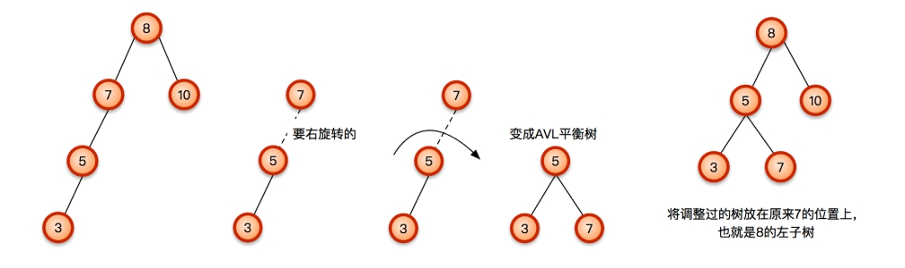
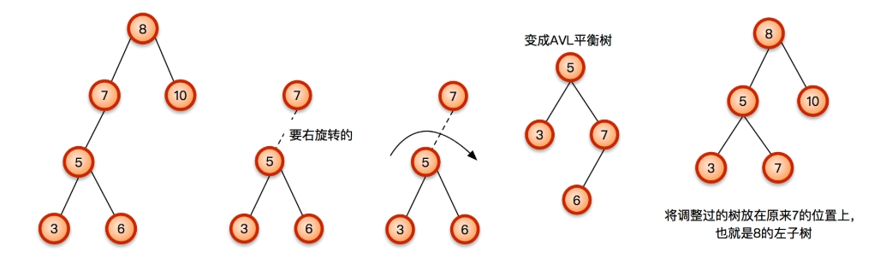
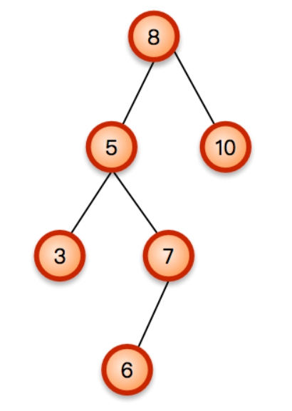
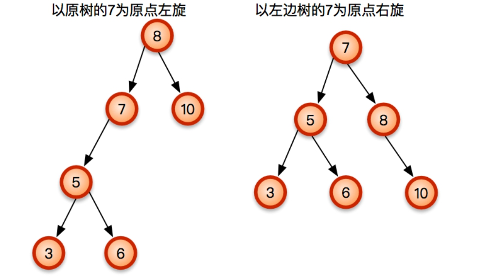
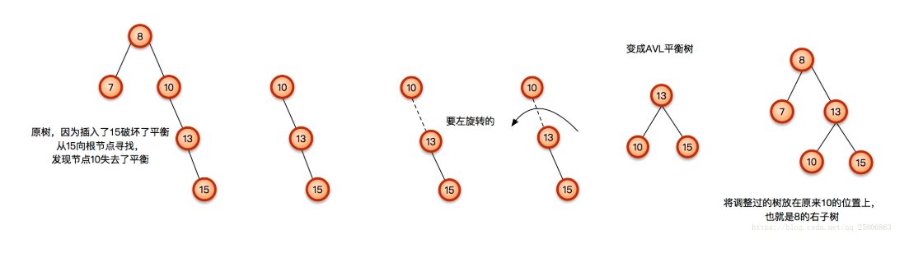
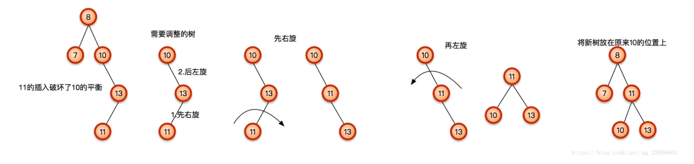
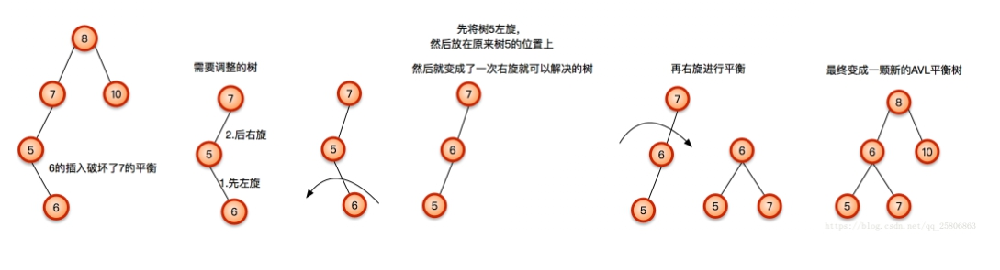

## AVL Tree
* * *
AVL Tree是個自平衡的二元搜尋樹，為什麼會自平衡這麼神奇呢，當然是因為有辛苦的勞工寫好程式碼阿。

### 如何定義平衡
平衡的算法為該節點往左子樹走到底的步數和往右子樹走到底的步數相減，而相減後的值為-1、0、1則為平衡，若非這三個數則為不平衡。 
簡單來說就是， |左子樹走到底的步數 - 右子樹走到底的步數| ≦ 1。

### 如何平衡
在每一次插入時有可能會破壞到AVL樹的平衡，所以我們把破壞平衡的種類分成四種。 

|破壞種類|描述|旋轉方式|
|----|----|----|
|LL|在節點的**左子樹**的根節點插入**左邊的節點**|右旋轉|
|RR|在節點的**右子樹**的根節點插入**右邊的節點**|左旋轉|
|LR|在節點的**左子樹**的根節點插入**右邊的節點**|先左旋轉，後右旋轉|
|RL|在節點的**右子樹**的根節點插入**左邊的節點**|先右旋轉，後左旋轉|

 
### 右旋轉
* * *
當一個節點需要右旋轉代表說我們在該節點的左子樹的根節點插入了一個破壞結構的左節點。 
下列就是我們插入了3的情況。

之後往上找發現7也出現了不平衡。

有沒有發現6不見了呢，其實這是因為這是個LR的問題所以我們必須要先左旋轉再右旋轉。

 
### 左旋轉
* * *

 
### 先右旋轉再左旋轉
* * *
當你的節點a出現不平衡而這不平衡是(左子樹走到底的步數 - 右子樹走到底的步數)<0，代表右邊比較多，這時候應該像剛剛一樣做左旋轉。 
**但是butしかし**當你a右邊的第一個節點是(左子樹走到底的步數 - 右子樹走到底的步數)>0，這時候我們要先對a右邊的第一個節點做右旋轉，再做a的左旋轉。

### 先左旋轉再右旋轉
* * *
這跟上面的意思很像但是剛好左右相反。

