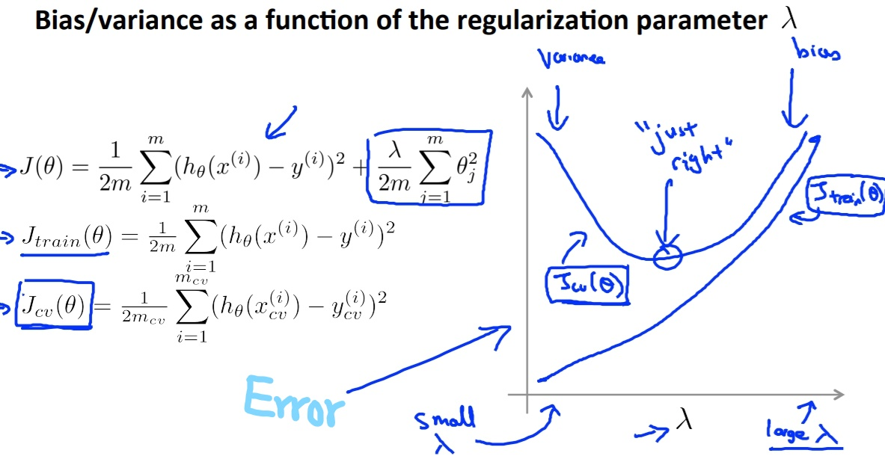

菜雞學ML

## Evaluating a Hypothesis
* * *
當我們建立好了我們的Model，取好了feature等等，我們如何評價一個Hypothesis是表現優良的。 
我們可以做的是拿所有的data區分成training data與test data，比例大概是70%與30%。我們的training data作用為拿來訓練Hypothesis而test data就是用於驗證我們的訓練好的Hypothesis是否優良。

## Evaluating a Hypothesis(part.2)
* * *
前面的分法是70%training data, 30%test data，然後我們如果用test data的Cost Function值低來當做這個Hypothesis是好的話，可能會有個小問題。 
因為有可能這個Hpothesis是剛好耦合test data而對於未來的猜測也不夠準確。

所以為了避免這一點，我們需要在更謹慎一點分割我們的資料。 
其中一個方法就是將data分成，training data, cross validation data, test data。 
Cross validation data的用意就是我們去用Cross validation data的Error來做選擇Hypothesis的判斷，最後我們再用Test data來驗證說這Hypothesis是否真的優良。

## Bias v.s. Variance
* * *
如何發現Model的問題，究竟是**High Bias(underfitting)**，還是**High variance(overfitting)**呢? 
我們可以透過下列作圖來得知。

## Regularization and Bias/Variance
* * *
透過Regularize我們也可以將過度耦合的Hypothesis做調整，講解請看[這裡](/ml/Week3-2-ML.html)。所以我們也可以透過plot出lambda跟Cost Function Error的關係圖，來得知好的lambda大概多少。

## Learning Curve
* * *
透過plot出learning curve我們可以了解到我們的Algorithm是否有出現關於資料數量的問題。 
我們plot出Jtrain(theta)跟Jcv(theta)，這兩個就可以替我們分析出是否有增加training data可以解決的問題。

## Decide what to do next
* * *

