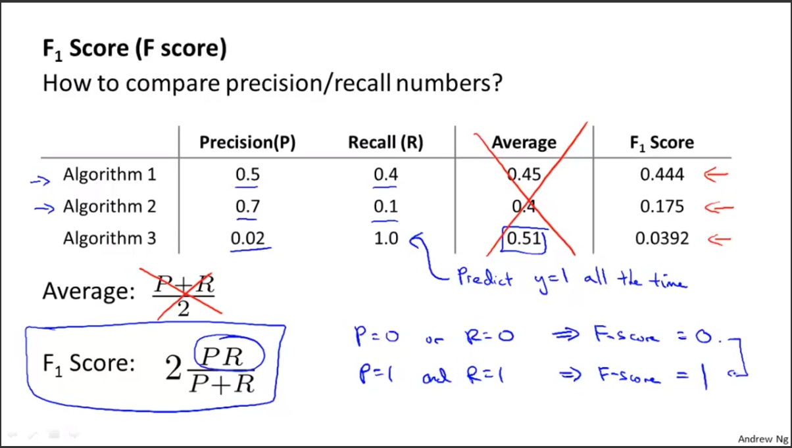

菜雞學ML

## Spam Classifier
* * *
這邊會介紹到建路Model的時候可能會遇到的問題或是要小心的東西。 
舉例為區分垃圾郵件。 
1. 如何建立Spam Classifier
* * *
要建立出監督式學習的Model我們要先取出X(features of email)。可能的feature是我們可以取出一些關鍵字像是deal, buy, discount, now, emergency等。 
我們可以將這些字囊轉換成Vector，來代表說這封信有沒有含有這些字彙。

但是現實社會我們不會去手動選擇100個字彙去訓練Model，我們會挑出平常人一般最常使用的10000~50000個字彙下去做訓練。

2. 如何讓我們的Spam Classifier表現更好(Low error)
* * *
第一個比較直覺的可能是增加我們的data set，但有時候可能大量的data set也無法幫助。 
這樣我們也可以考慮增加我們的feature數量，例如可以將header或是eamil的地址來當作feature。 
也可以去增進原有的data set，像是我們是否應該將discount與discounts算在一起，又或是我們是否要偵測錯誤的拼音，像是watches變成w4tches等等。

## Recommended approach
* * *
1. 快速的建置出簡單的Model並跑過一次。

2. plot出learning curve並去決定是需要更多的data, 更多的feature等等。

3. 分析錯誤，人工的去看過cross validation判斷錯誤的地方，去看看是否有某些規律可以去排除。
例如我們validation set中有500個資料量但是我們在100都出錯，那我們可以做的可能是可以將這些錯誤分類，離如說這些email是推銷的或是釣魚信件或是販賣仿造品等等。透過這個分類我們可以知道我們在哪個種類表現得不好，讓我們可以透過增加feature去增進這些種類的正確率。

## Skewed Classes
* * *
例如我們現在有個癌症分類器，這個Classifier有99%的正確率，只有1%的錯誤率。這看起來或許是非常好的Classifier。但是如果我們後來發現其實這個test set裡面只有0.5%的人患有癌症，這個意思代表說我們只要寫一行程式讓我們忽略掉所有的患有癌症的人，這樣我們的程式就會有99.5%的正確率了。 
這代表說有時候我們的正確率無法準確地提供說這個Classifier是否是好的，這時我們就需要新的檢驗標準，那就是Precision/Recall。 
>**Precision**讓我們知道我們認定為y=1(患有癌症)的所有data中，有多少的data是真的y=1(患有癌症)而不是y=0(沒有癌症)。

>**Recall**讓我們知道所有真的y=1(患有癌症)的病人中，我們有準確測出y=1(患有癌症)的比率。

## Trading Off(平衡) Precision and Recall
* * *
一樣拿癌症預測來做例子，我們有個logistic regression，這時候我們可以去更改我們的判斷值，原本大於0.5我們就判斷她患有癌症，我們可以透過更動這個值來調整我們的Precision Recall值。  
例如我們把值調高這樣我們會在有更多的信心下才會說這個人患有癌症，可是這時候Recall值會降低，代表我們會損失某些其實有癌症的人但是我們判斷出他沒有癌症。 
我們也可以去降低這個值，這樣我們會更容易說這個人有癌症，但是我們的Precision值會降低，代表說我們會跟更多其實沒有癌症的人說我們判斷出你有癌症。 
這是一把雙面刃，其實是看你想得到的結果是什麼而去做選擇。

那我們如何去比較precision/recall呢?答案就是F score。

## Data for Machine Learning
* * *
Andrew說一開始不要盲目地花大量的時間去蒐集大量的Data來訓練model，但是有些情況我們可以透過大樣的data set就訓練出不錯的Model。 
但是這些情況必須要通過以下假設。  
X feature值必須要是已經含有足夠的資訊讓我們去預測y。我們可以想像一個專家看著我們的features能不能做出正確的判斷，如果他可以的話代表說其實我們的feature數量是已經足夠的。
 
透過足夠的X features我們可以達到low bias，再透過大量的data set我可以達到low variance。

