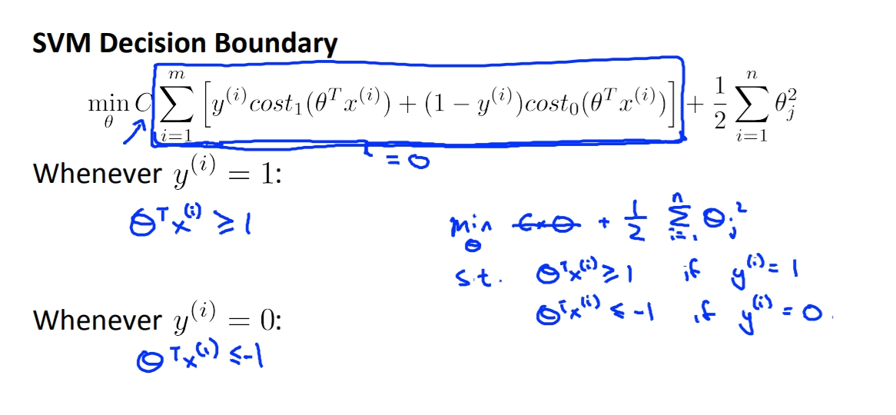

菜雞學ML

## 從Logistic Regression推導
* * *
在logistic regression的時候我們使用sigmoid當作我們的激活函數，而畫出來的圖會長這樣。

所以當我們y=1的時候我們會希望我們的h(x) 趨近 1也就是ThetaX會遠大於0 
相反來說如果我們y=0，我們會希望h(x) 趨近 0，也就是ThetaX會遠小於0  

再來讓我們把Cost Function畫出來。

當y=1的時候每當Z越大，數字就越小，而Cost Function的質也就越小，所以在y=1的地方就跟上面得出的原理一樣，我們會想要Z(ThetaX)越大。 
而相反就同理推定。 
但是SVM的圖形是想要畫出粗藍線的，以y=1來看的話就是在大於1的地方都是0，在小於1的地方是直線的，這個特性會讓SVM有自己的優勢與特點，之後的課程會講述到。  
這邊也有講述到SVM的Cost Function，SVM的Cost Function簡單來看就是logistic中的lambda移到前面變成C。

## SVM 介紹
* * *
這裡我們細看一下SVM的Cost Function，SVM的Cost Function在y=1的時候我們將ThetaX>=1而非只是>=0而已，而y=0的時候我們會希望ThetaX<=-1而不只是<0。

這裡我們提一個假設，如果我們把C設為一個很大的數字會發生什麼事。 
如果C很大的話會導致我們會想要ZegamaSum的地方會趨近於0，而這個導出的結論會有關於之後我們的推導。這結論就是y=1時ThetaX大於等於1，y=0時ThetaX小於等於-1。 

上一頁的結論會讓SVM有large margin的特色，也就是SVM會去找margin最大的線去區分兩個不同的樣本。這個原理會在之後講到。

## Math behind Large Magin Classification
* * *
1. Vector Inner Product
將兩個vector內積所會得到的東西就是u^Tv = p * ||u||，p為v project在u上的向量的norm倍率。而相反來說v^Tu也會得到一樣的結果，也就是v^Tu = p * ||v||。

2. SVM Decision Boundary
將我們剛剛對於內積的理解我們套用到SVM的Cost Function在這裡應該是有假設C為很大的數字，導致我們只需要留下最後面的正規化部分。這裡也因為講解簡單而假設Theta(0) = 0。 
我們發現Theta^TX跟剛剛的內積很像，所以我們其實可以把內積的概念套進來。首先我們將正規化的數字改造一下發現其實等於0.5*norm(Theta)^2。 
再來我們可以將Theta^TX當作內積處理做plot如下面的圖並得到p(i)，我們也會得知Theta^TX = p * ||Theta|| = Theta(1)X(1) + Theta(2)X(2)。

3. SVM Decision Boundary
再來我們將解釋為何剛剛的特性會讓SVM不會選擇small margin boundary。 
我們會發現說如果取的Decision Boundary太近於樣本，這樣p就會比較小，而為了達到p*||Theta||>=1，||Theta||就會比較大，也代表說上面的Zegma Sum(Theta)不會是最小 
而如果取的線是large margin像是右邊，這樣每個p都會比左邊的大也導致Theta比較小。 

