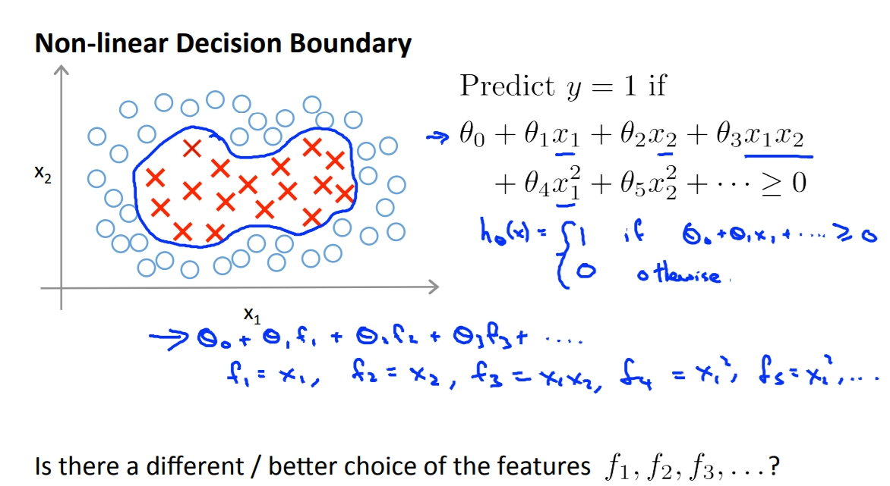
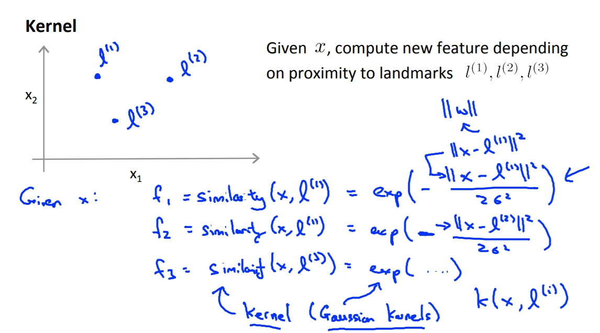
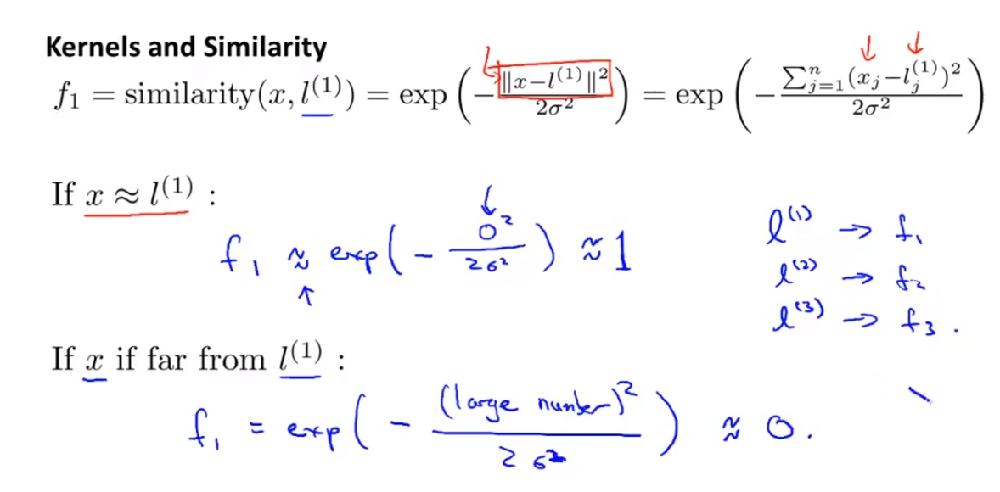
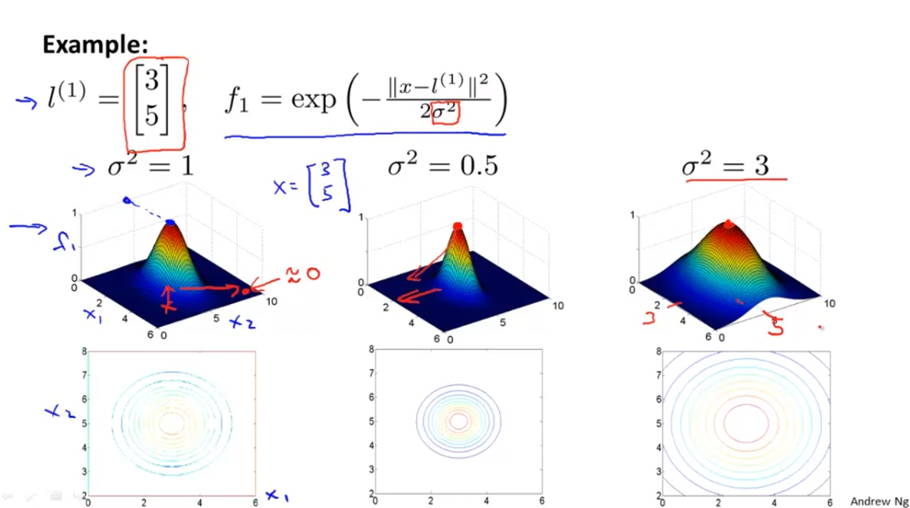
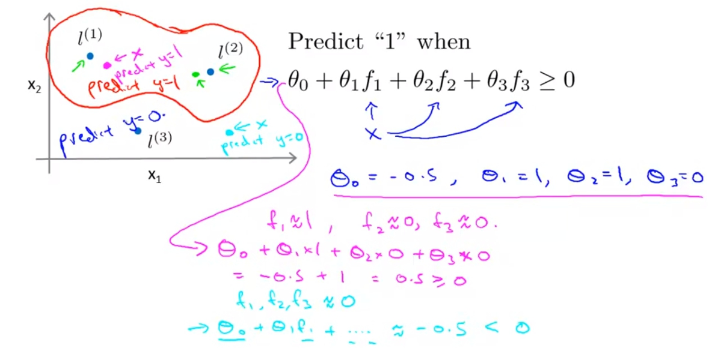
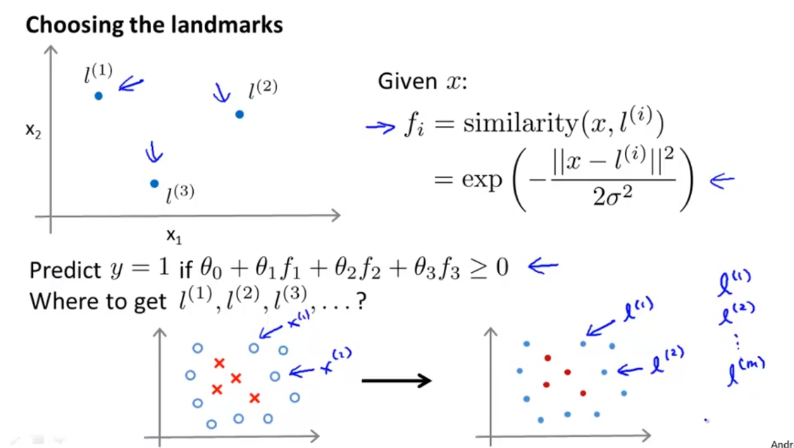
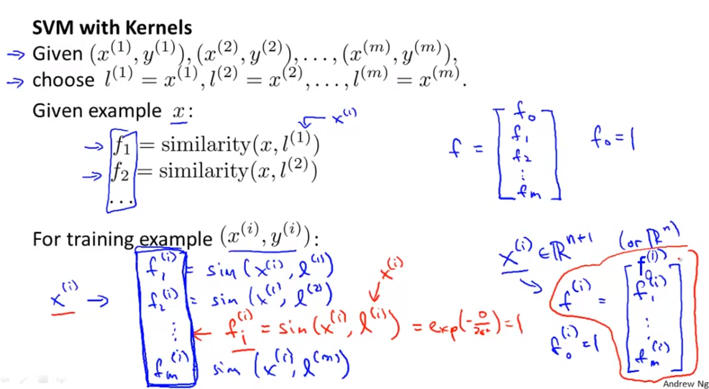
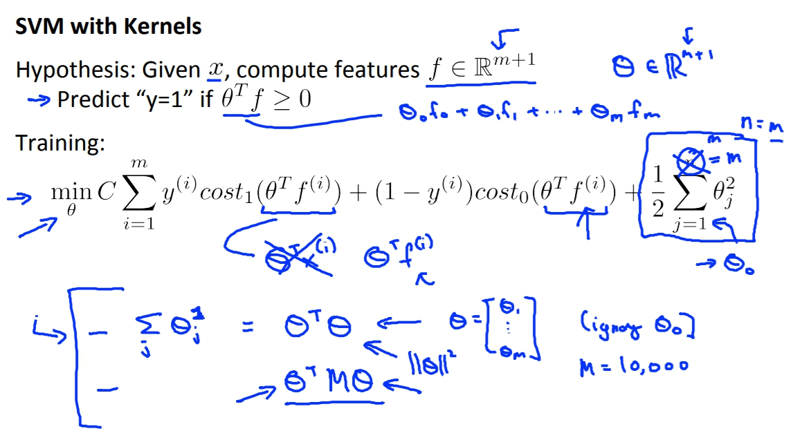

菜雞學ML

## Kernels
* * *
當我們要建構出一個non-linear Decision Boundary的時候，我們直覺的就是用更多的高次方項式來當作feature，但是我們有沒有更好的方法可以選擇feature而不是這些高階項式呢，因為太多高階項式會造成大量的運算。

今天如果我們要取新的三個features:f1 f2 f3，現在我們現在圖上手動挑選三個點l1 l2 l3。而我們的新feature就使用x與這三個landmark點的相似度當作feature。 
f1 = similarity(x, l1) = exp(.....) 
f2 = similarity(x, l2) = exp(.....) 
f3 = similarity(x, l3) = exp(.....) 
這裡的similarity就是Kernel，而這種exp(...)算法又叫做gaussian kernel。

## Kernels and Similarity
* * *
這張圖會解釋說f1 f2 f3以及l1 l2 l3的關係。exp裡面的函式上方就是x與點的距離，當x與l很近那得出得f就會趨近於1，但相反的如果x與landmark很遠那麼f就會趨近於0。

Example: 
在這裡我們把l1選在(3,5)，sigma^2 = 1。畫出來的圖就會像下方。 
我們也可以透過改變sigma來改變範圍。

計算的舉例： 
我們可以用下列的圖來簡單舉例計算的情況。 
因為Theta(3)等於0，所以只要是接近l1或是l2的點都會被預測為y=1因為Theta(1),Theta(2)都是1，這讓我們的Decision Boundary會呈現像是紅色的線。

## SVM + Kernel
* * *
實際應用landmark的時候，我們可以將landmark直接定義為我們data set中的點的位置，例如l1 = m1, l2 = m2，這樣每個feature就代表著與實際有的點的距離。 

SVM + Kernel的用法就是把f矩陣算出來，再帶入原本的Cost Function。 
另外有補充外部的SVM有時會將Theta^T*Theta中間插入一個矩陣M，這個的做法有時是為了增價SVM的運算效率，像是遇到大量的feature時等等等，Andrew在此不贅述。 
另外我們也可以將Kernel運用到其他的Maching Learning演算法例如Logistic Regression，但這是因為Gaussain Kernel比較好推廣，其他的可能就不太行。

**Andrew還說不建議自己寫SVM阿哈哈哈，可以用別人寫好的成熟軟件包就好。** 
不過有個重點就是C的取值，C的功用相似於1/lambda所以功效也會跟lambda相反。 
而sigma也會對bias, variance有影響。

