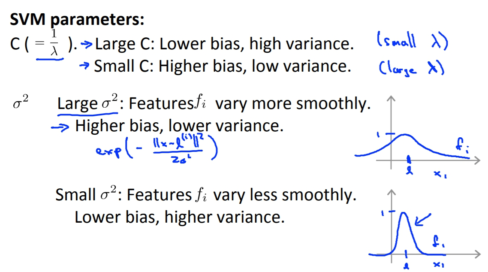
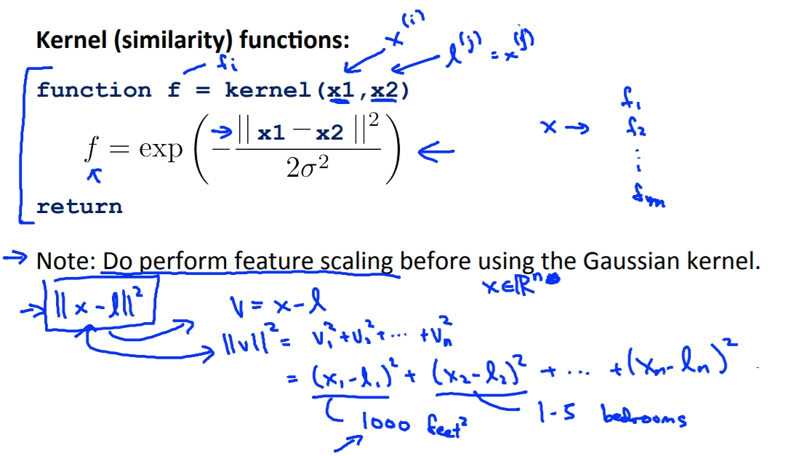
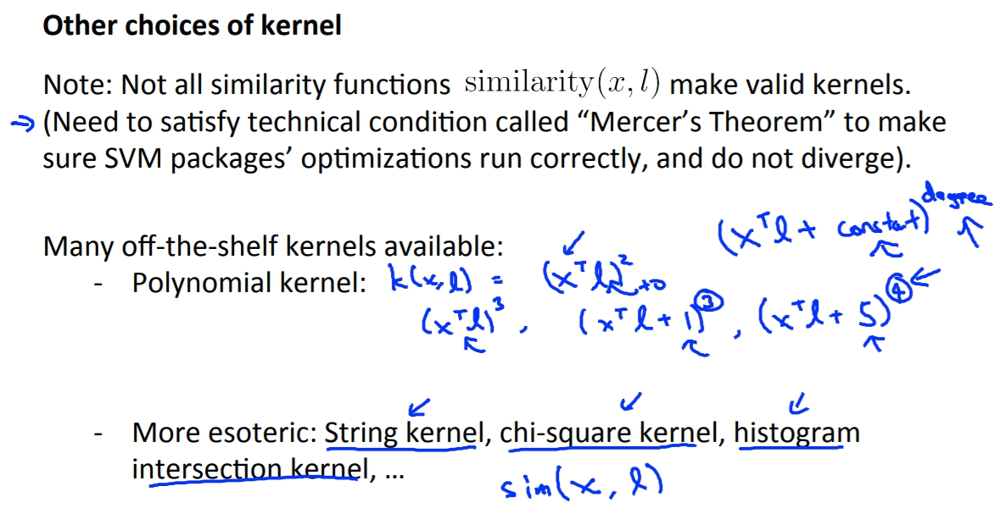
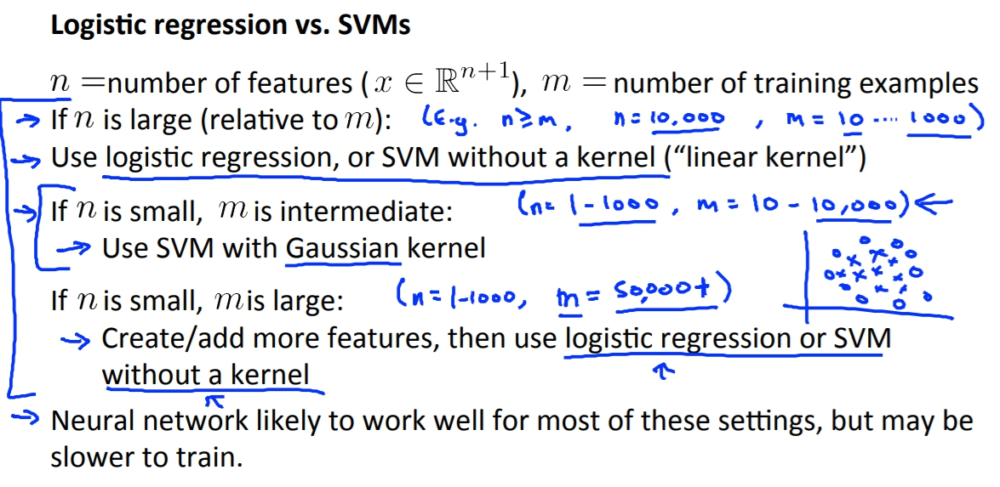

菜雞學ML

## Kernels
* * *
當我們要建構出一個non-linear Decision Boundary的時候，我們直覺的就是用更多的高次方項式來當作feature，但是我們有沒有更好的方法可以選擇feature而不是這些高階項式呢，因為太多高階項式會造成大量的運算。

今天如果我們要取新的三個features:f1 f2 f3，現在我們現在圖上手動挑選三個點l1 l2 l3。而我們的新feature就使用x與這三個landmark點的相似度當作feature。 
f1 = similarity(x, l1) = exp(.....) 
f2 = similarity(x, l2) = exp(.....) 
f3 = similarity(x, l3) = exp(.....) 
這裡的similarity就是Kernel，而這種exp(...)算法又叫做gaussian kernel。

## Kernels and Similarity
* * *
這張圖會解釋說f1 f2 f3以及l1 l2 l3的關係。exp裡面的函式上方就是x與點的距離，當x與l很近那得出得f就會趨近於1，但相反的如果x與landmark很遠那麼f就會趨近於0。

Example: 
在這裡我們把l1選在(3,5)，sigma^2 = 1。畫出來的圖就會像下方。 
我們也可以透過改變sigma來改變範圍。

計算的舉例： 
我們可以用下列的圖來簡單舉例計算的情況。 
因為Theta(3)等於0，所以只要是接近l1或是l2的點都會被預測為y=1因為Theta(1),Theta(2)都是1，這讓我們的Decision Boundary會呈現像是紅色的線。

## SVM + Kernel
* * *
實際應用landmark的時候，我們可以將landmark直接定義為我們data set中的點的位置，例如l1 = m1, l2 = m2，這樣每個feature就代表著與實際有的點的距離。 

SVM + Kernel的用法就是把f矩陣算出來，再帶入原本的Cost Function。 
另外有補充外部的SVM有時會將Theta^T*Theta中間插入一個矩陣M，這個的做法有時是為了增價SVM的運算效率，像是遇到大量的feature時等等等，Andrew在此不贅述。 
另外我們也可以將Kernel運用到其他的Maching Learning演算法例如Logistic Regression，但這是因為Gaussain Kernel比較好推廣，其他的可能就不太行。

**Andrew還說不建議自己寫SVM阿哈哈哈，可以用別人寫好的成熟軟件包就好。** 
不過有個重點就是C的取值，C的功用相似於1/lambda所以功效也會跟lambda相反。 
而sigma也會對bias, variance有影響。

## Use SVM
* * *
真正在使用SVM的時候我們可以不用實作自己的SVM，因為很難。但我們還是要選擇自己的C以及選擇自己的Kernel。另外也有一種Kernel叫做Linear Kernel這就是沒有選擇Kernel單純用Theta^T(X)。 
另外在使用Gaussian Kernel得時候我們還要選擇sigma來控制函數。 
還有很重要的是要對feature做scaling，不然值太大feature會影響到權重。例如圖片的最下面，當第一個feature都是好幾千而後面的feature的都是個位數，這樣第一個feature就會容易影響到||X - l||^2的值。

如果要選擇其他的Kernel或是自己寫的話都要符合**Mercer's Theorem**，這個理論就是確定寫出來的Kernel可以套用到大部分的最佳化算法，來加速SVM的進行。

## Multi Class
* * *
很多的SVM套件都有內建多種類的訓練功能，但如果沒有的話我們還是可以透過one vs all來實作，也就是說如果我們有K個種類，我們就訓練出K個SVM然後把預測值帶進每個SVM，看哪個出來的分數最高。

## Logistic Regression VS SVM
* * *
這兩個到底要如何選擇呢？ 
當我們假設n = number of features, m = number of training examples。  

當n很大的時候(相較於)，例如 n >= m, n = 10000, m = 10 .... 1000 
這樣建議用logistic regression 或是 SVM without kernek。  

如果n小, m中等，例如 n = 1 ... 1000, m = 10 ... 10000 
使用SVM with Gaussian kernek。  

如果n小, m很大時，例如 n = 1 ... 1000, m = 500000+ 
建議增加feature後使用logistic regression或是SVM without kernel。

