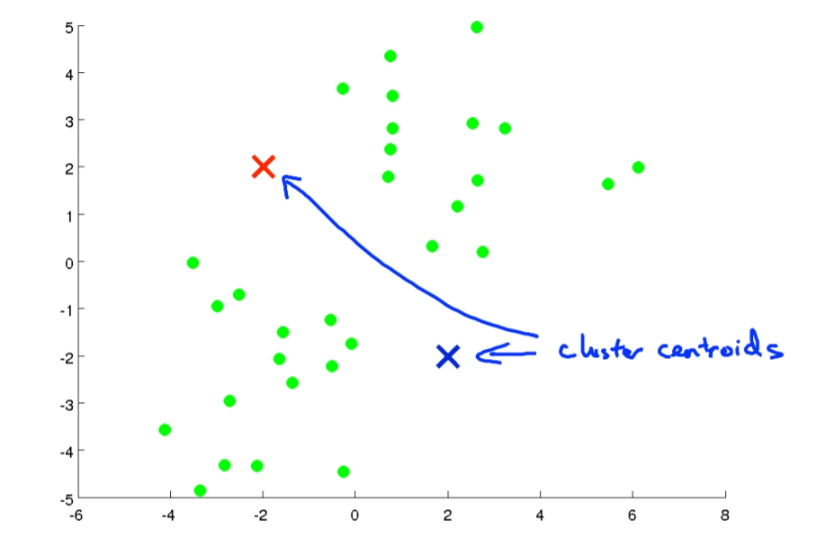
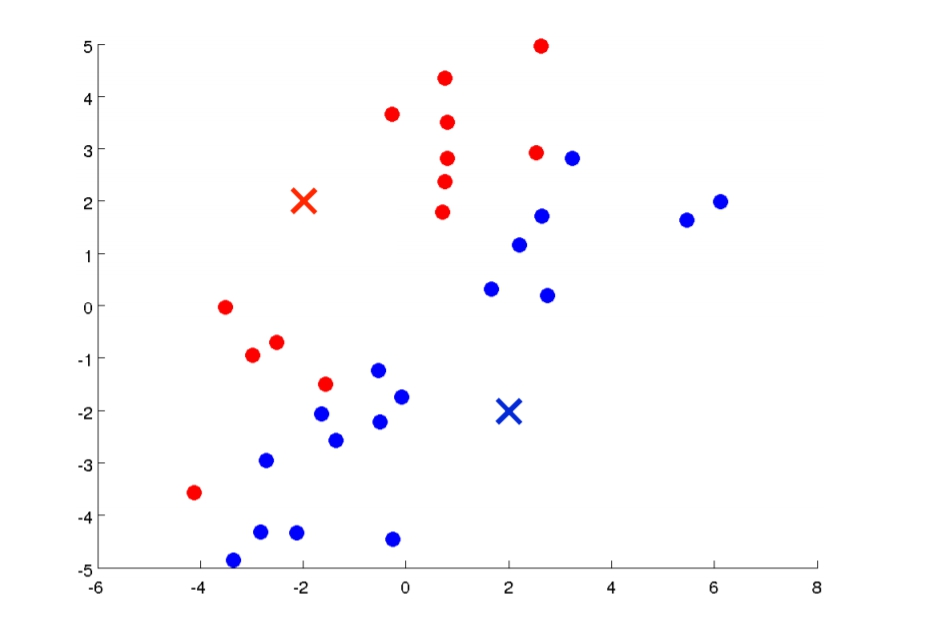
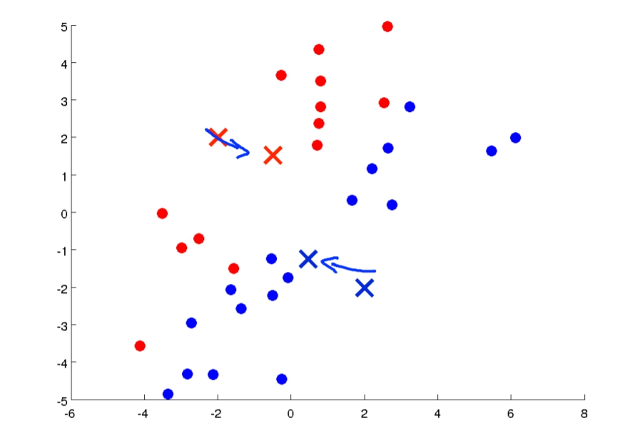
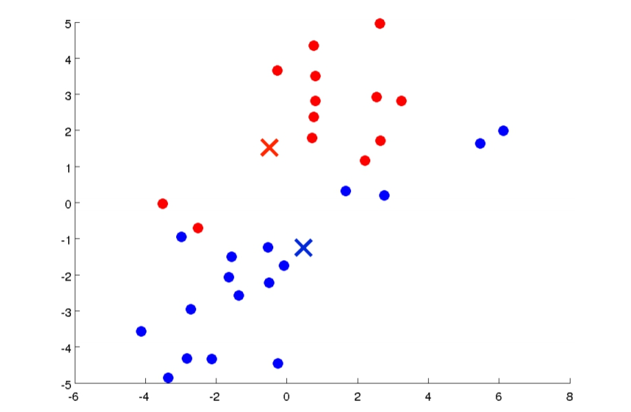
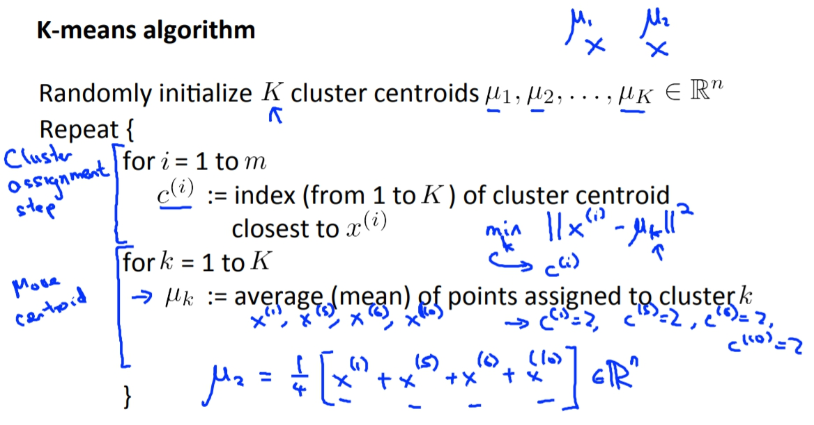
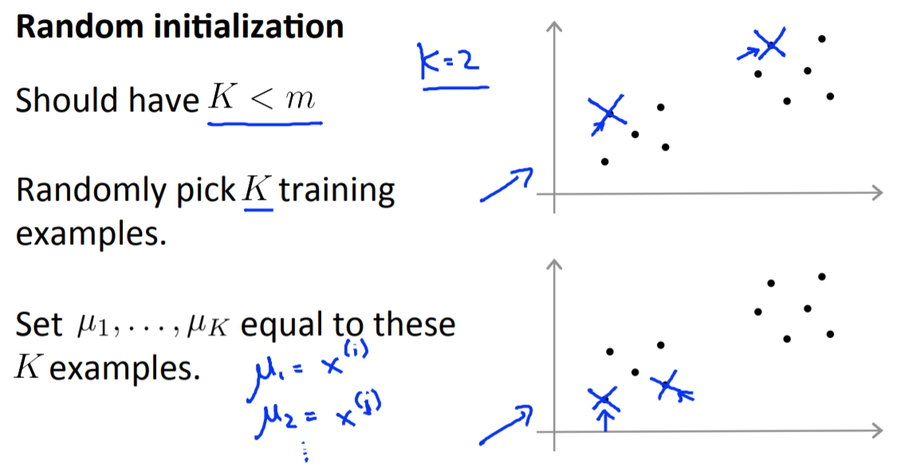
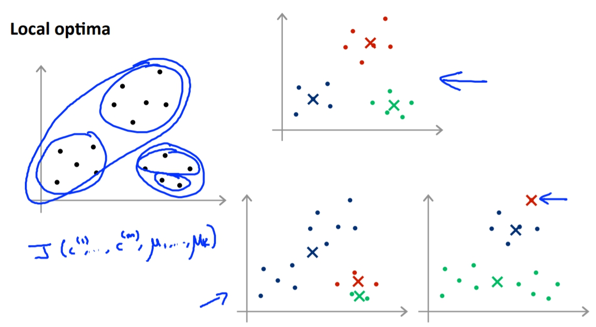
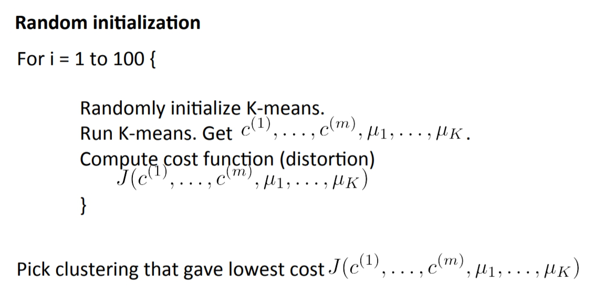
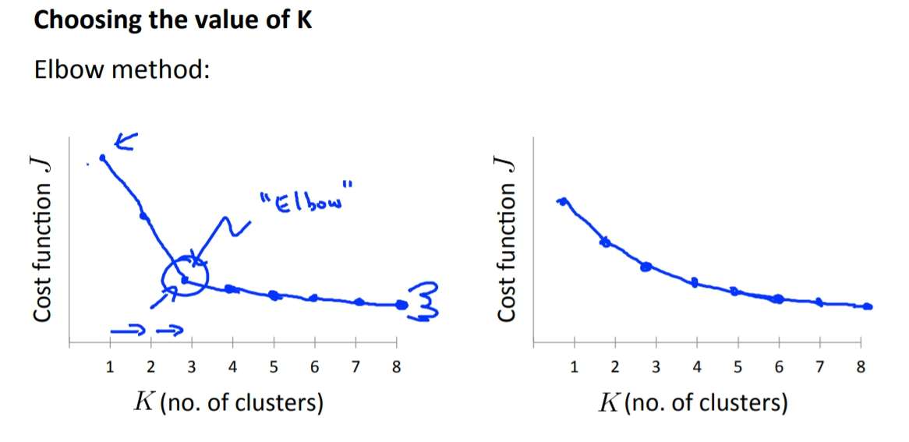
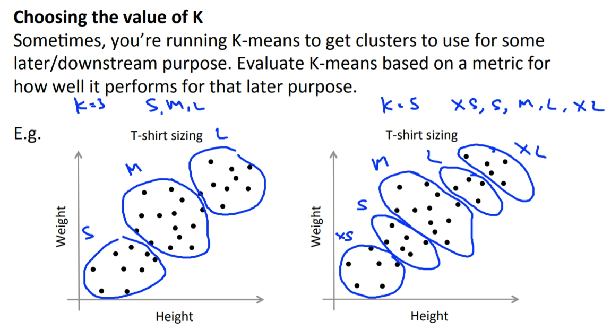

菜雞學ML

## K-Means - Clustering Algorithm
* * *
這邊會介紹K-means，K-Means是目前最被廣用的Unsupervised Learning Algorithm之一。 
1. 我們會在圖上選點當作Cluster Centroids(叢中心)，而選幾個點是依據你想分幾組而定。 

2. Cluster Assignments:會透過上一個步驟所選的點，依據每個data距離點的遠近來分成若干組。

3. Move Centroid:我們會將最初選擇的點，重新移動位置，移到他那組的data的平均點，例如紅色叉叉就會移到紅色點點的平均值位置。

4. 重複回到第二步。

持續下去後就會變得更加區分這兩組。

## K-means input
- K(number of clusters)
- Training set {x1 x2 x3 .... xm} 
下面圖片是正式的K-Means步驟寫法，不過跟上面的簡單版一樣意思。

## K-means initialize point
* * *
最好的方法就是，把Cluster Centroids隨機設在data set上。

另外，K-means有可能會遇到local optima的問題，如下。

這時候我們的解決方法就是跑K-means很多次，每次都用不同的initial point去跑，這樣我們就會得到非常多種的Cost。我們在挑最低的cost function當作正解。

## Choosing number of cluster
* * *
Andrew說其實沒有很好的方法可以去決定要有多少cluster阿，所以最好和很多人使用的方法是用**手動**!! 
1. Elbow Method
* * *
我們把Cost跟Cluster的關係圖畫出來，有時我們會得到一個elbow點這樣我們就可選那個elbow當作cluster要多少個。 
但是butしかし，大部分時候畫出來的圖會比較圓滑，這時候就無法清楚的知道elbow點在哪，就又變成很難選點了。

2. 結果論
* * *
又或者我們K-means的cluster數量主要是為了滿足結果的族群數量，Andrew就舉例說成衣業如果要區分出衣服的族群，那決定出的cluster數量就是size的數量。可能成衣業想要S M L而已抑或是他們覺得有更多的size可以滿足更多的客戶，而這個就決定了cluster的數量。

