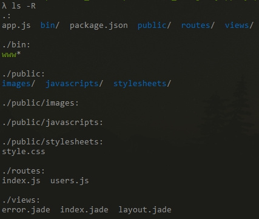

## 概要
* * *
從半年就有想要開始學Nodejs的想法，但是因為一直有點怠惰所以慢慢拖延，一瞬間就又半年過去了。所以趁著最近有許多自己的時間，來學習一下這個成名有段時間的Js全端套件。<br>
本篇程式碼<a href="https://github.com/a28283878/Nodejs_JapaneseExam" class="menu-link" target="_blank"><i class="fa fa-github" aria-hidden="true" style="font-size:48px;"></i></a>

## 設置
* * *
這次主要使用的node module有：
1. Express (mvc 框架)
* * *
這個是蠻多人推薦使用的mvc框架，透過express的middleware的架構我們就可以輕鬆又有邏輯的開發(應該吧!?)

2. MySQL
* * *
本人因為Workbench灌好好的原因所以我就直接拿mysql來使用了，不過原本是蠻想用用看mongoDB，但是就留到下次吧。

3. nodemon
* * *
如果使用原始的`npm start`，每當我們有更新我們就要自己重啟，但是如果有安裝nodemon的話她會自動去偵測是否有改動，並且自動重啟，真是好棒呢。

4. express-validator
* * *
這是個express開發的後端驗證表單工具，其中有許多定義好的function例如`isEmail()`之類的，並且我們也可以自己設置想要的驗證function與error msg。

再來我就會逐一介紹一下開發的流程，也讓自己日後有查閱的地方。

## Express
* * *
使用middleware的架構，跟.net core還有go gorilla很像所以還好之前有碰過呢。<br>
我們只要輸入`express myapp`就可以在資料夾裡面產生出乾淨的express架構，可是原始的express html renderer是jade，如果想要用別的renderer的話要打，`express --view={renderer name} myapp`或是很麻煩的到app.js裡面修改。<br>
產生完之後就會有乾淨的結構囉。


## MySQL
* * *
我們首先需要安裝`npm install mysql`，然後我們將要連上database的config另外獨立出一個檔案，這樣到時候把它設成gitignore就不會被git上傳上去了。<br>
然後我自己會在最外層新增一個dao或是model的資料夾，這個資料夾再來就都會儲存關於資料庫操作的程式碼。<br>
首先我們先在../dao裡面新增第一個js，db.js。這個js會用來建立連線並exports他，讓其他js可以使用連線來存取database。
```js
// ../dao/db.js
var sqlConnect = require('../conf/conf');
var mysql = require('mysql');

var connection = mysql.createConnection(sqlConnect.mysql);
connection.connect(function(err) {
    if (err) throw err
    console.log('You are now connected...')
});

module.exports = connection;   
```
再來我們就可以在dao裡面新增其他SQL囉!，例如user.js。<br>
下面這個user.js就已經完成了createUser的function囉，其他js如果想要創建使用者就只需要require('../dao/user.js')，就可以使用這個function了。
```js
// ../dao/user.js
var db = require('./db');

var user = {};

user.createUser = function getUserNumByName(username, name, password, callback) {
    //使用username 來檢查是否有資料

     var sql = `INSERT INTO users (username, name, password) values (?, ?, ?)`
     db.query(sql, [username, name, password], function (err, result) {
         //查詢結果使用 callback 呼叫，並將 err, result 參數帶入
         callback(err,result);                    
     });       
};

module.exports = user;
```

## express-validator
* * *
這是個很有趣的東西，使用方法好像在今年有大改過所以是很新很新的版本。<br>
以下是他的寫法，他是寫在router.method function裡面的handler地方，如果有錯誤我們可以透過`validationResult(req)`來取得，然後透過`res.render()`或是`res.send()`去呈現在頁面上。
```js
router.post('/insert',[check('word_type').isNumeric().withMessage("word type need to be numeric").not().isEmpty().withMessage("word type could not be empty"),
  check('word_japanese').isString().withMessage("japanese need to be string").not().isEmpty().withMessage("japanese could not be empty"),
  check('word_chinese').isString().withMessage("chinese need to be string").not().isEmpty().withMessage("chinese could not be empty")], 
  function(req, res){
  const errors = validationResult(req);
  if (!errors.isEmpty()) {
    return res.render('/page', {errors: errors.arrau()};
  }
});
```

## 待改進
* * *
### 雜亂
原本這次是要使用api的方式呈現，但是因為還是想要有個頁面結果就有點混再一起，之後有空會再將程式拆成兩個部分，頁面呈現以及api。

### callback hell
因為db的回傳都是使用callback導致賦值不容易又有異部的問題，例如reponse的重複寫入就擾亂了我好多次之後使用api跟頁面拆開就會好很多。但是還是希望再來能透過`promise`來寫出更好的function。