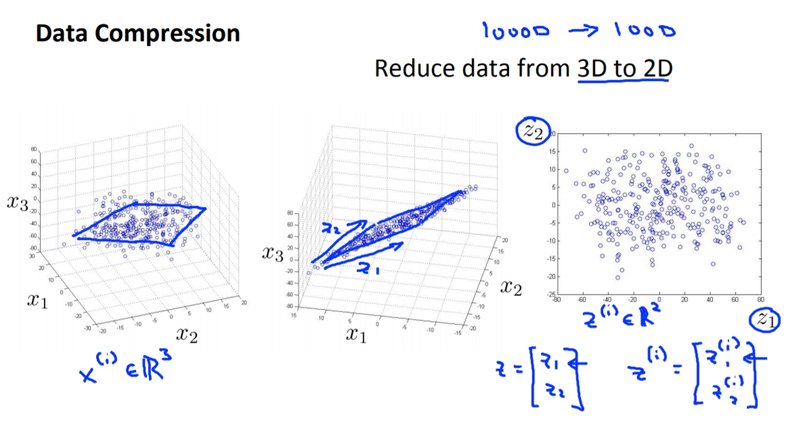

菜雞學ML

## Dimensionality Reduction Problem
* * *
在有些問題中我們會需要透過降維度的方式來達到要求。
## Motivation1 - Data Compression
如果我們原本有兩個feature一個是cm一個是inche，這時候我們發現這是沒有用的，我們會希望把2D轉換成1D。

另外也能將3D轉會為2D，如果data都集中在一個平面上的畫。


## Motivation2 - Visualization
另一個是當我們想要呈現出多維度的資料的時候，因為最多能一次呈現就是3維，所以我們必須把維度降到2D或是3D。

## Principal Component Analysis
* * *
1. data preprocession
feature scaling and mean normalization(要讓它通過不會每個維度的值相差太大)。
2. PCA algorithm
目的為找到一個低維度的子空間，然後將數據投影到子空間上，並且最小化誤差平方和。<br>
例如找出2D中u(1)或是3D中的u(1), u(2)。<br>


## Reconstruction Principal Component Analysis
* * *


## choosing k (number of principal components)
* * *
這個k就是我們想要降到k維度的k。<br>
這邊會講到如何選擇k，照理來說k要越小越好，但是k越小代表說我們會失去的資料越多，所以我們必須選擇一個不會失去太多但又不會維度太大的k。<br>
這時候我們要先學學如何去評斷資料失去多少。<br>
```
Average squared projection error: 這個就是我的個cost
Total variation in the data: 就是data的變異數(沒有扣掉mu是因為已經做過data preprocession)
```


## adivse for using PCA
* * *
## Supervised learning speedup
當feature維度過高時(可能10000)，那不管我們跑什麼algorithm都會很慢，那這時候我們可以透過使用PCA降維度，進而加速演算法。

## not to use to prevent overfitting


## not to use at first time


