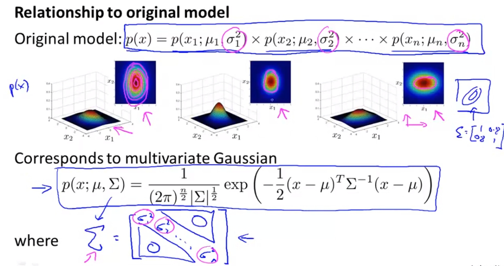

菜雞學ML

## Motivation : anomaly detection (異常檢測)
* * *
在許多情況下我們會想做異常檢測，透過蒐集大量的資料後我們去判斷新進來的資料是不是有異常的。例如說我們紀錄每個飛機引擎的震動以及熱度，再來我們蒐集大量的正常引擎的資料，每當有新的引擎要出廠之前我們就先將他的震動以及熱度資料輸入我們的model，藉此判斷說這顆引擎是否是正常的。

## Gaussian Distribution
* * *
高斯分布的機率算法，如過要定義出高斯分布我們就必須要有
`
mu
`
跟
`
\sigma^{2}
`

以下是
`
mu
`
跟
`
\sigma^{2}
`
的算法，就跟以前學的統計差不多，可是有人會喜歡用
`
\frac{1}{m-1}
`
而不是
`
\frac{1}{m}
`
，但是ml界的人士比較喜歡用第二個。兩者的誤差也非常小。

## Gaussian apply to anomaly detection
* * *
假設我們有Training Set : 
`
{\chi^{(1)}, ...,\chi^{(m)}}
`
, 且Each Example is 
`
\chi \in \mathbb{R}^{n}
`
。 我我們假設最後得出的機率是每個X的feature的機率相乘，就像下列圖片。

再來就是進行以下步驟： 
1. 選擇你要的feature，像是那些你覺得可能會有問題的資料等等。
2. 計算出
`
mu \sigma^{2}
`
3. 計算出p(x)，也就是跟大部分的東西相同的機率(與大部分的東西越像代表越不是異常)。

## evaluating model
* * *
一樣我們再拿飛機引擎做例子，但這是我們要假設我們有一些已經有標籤的data(這樣才能比較有沒有預測正確)，並且我們再將資料拆分為：
1. Training set:
`
\chi^{(1)}, \chi^{(2)}, \chi^{(3)}, ...,\chi^{(m)}
`
(必須要都是normal data，這樣越像是這些training data的資料才會是normal)
2. Cross validation set
3. Test set

記得不要將三個set的data互用，因為這樣就失去一開始將它們分開的意義了。

### Evaluation
再來就是要去測試這個model了，一般來說我們會去使用cross validation/test data比對說正確率，但是當資料是非常skewed(歪斜的)的話，像是1000筆資料中只有10筆資料是有問題的，那這時候如果有個model全部都回答沒有問題，他還是有99%的正確率。 
所以更好的方法是使用TF table, Precision/Recall, F1 score去測試這個model。

## Anomaly detection VS. Supervised learning
* * *
Anomaly detection適合用在有大量negative examples的場合而只需要小量的positive examples，然而監督式學習無法在只有少量資料的情況下達到有效的學習。
另一種是有非常多不同種的錯誤，這對於監督式學習來說會非常痛苦，因為他的decision boundary要包覆住這些不同的情況，但是anomaly detection純粹只是因為他跟正常不一樣就認定他不正常所以特別容易實作。

## What feature to choose
* * *

### non-gaussian features
如果feature plot出來不像是高斯分布的話，我們可以對feature做一些轉換，讓他長得更像高斯分布。像是log(x), x^0.5 ...等等都有機會。

### error analysis
我們期望的是p(x) is large for normal examples. 
p(x) is small for anomalous examples. 
 
所以在我們選則feature的時候我們會去看anomalous的data看看是否能啟發出有哪些其他的feature可以區別出正常與不正常的差別。 
而新的feature會將原本就在機率地的data，也同樣標在機率低的地方這樣才是有用處的feature。

## Multivariate Gaussian Distribution(多元高斯分布)
* * *
這裡的舉例是memory use與cpu use的關係，一般來說若memory use越大cpu use也會越大，像是圖中左邊一樣會呈現出一個藍色的橢圓形。這時候如果有一個綠色的點代表說很高的memory use可是卻只有很低的cpu use，這應該會是個異常。 
但是如果我們去用上面學的anomaly detection的一般高斯分布會發現出，綠色的點在高斯分布裡面都不算是太邊緣，很有可能得出的p(x)不夠小，不會被判斷為不正常。 
這問題的原因是使用一般高斯分布的anomaly detection無法針對藍色橢圓下去做界定，而是使用一個同心圓的方法，這時候就發現綠色的點其實沒有離圓心很遠，因此不會被判斷成不正常。

透過Multivariate Gaussaion distribution我們可以改善這個問題，而多元高斯跟一般高斯不同的就是，我們使用多個X當作輸入，不再一個一個的分開做高斯分布。

這樣我們就能做出更多不一樣的高斯分布。

## 多元高斯分布 apply to anomaly detection
* * *
一樣我們算出
`
mu, \Sigma
`
，這樣我們就會發現新的多元高斯分布就會將綠色的點排除在外了。

### Relationship to origin model(一般高斯分布)
我們之前使用的高斯分布相乘與多元高斯分布之間的關係，其實原本的高斯分布相乘其實是多元高斯分布的一種特例，而那個特例就是
`
\Sigma
`
必須要是diagonal matrix，也就是只有對角有值。

### Original model VS multivariate Gaussian
其實原本的問題也可以不用多元高斯分布來解，我們可以單純新增一個新的feature像是cpuload/memory這樣就可以讓新的model有很好的結果。 
而且原本的model也適合有大量的feature，因為計算更不用耗資源。

