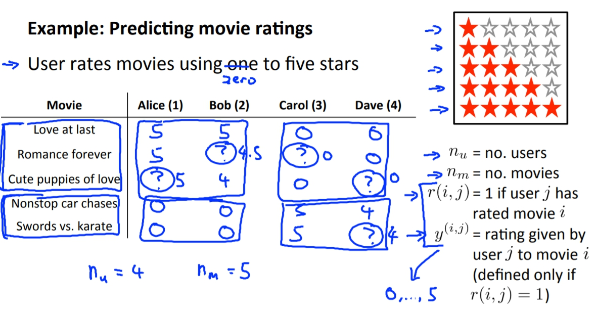
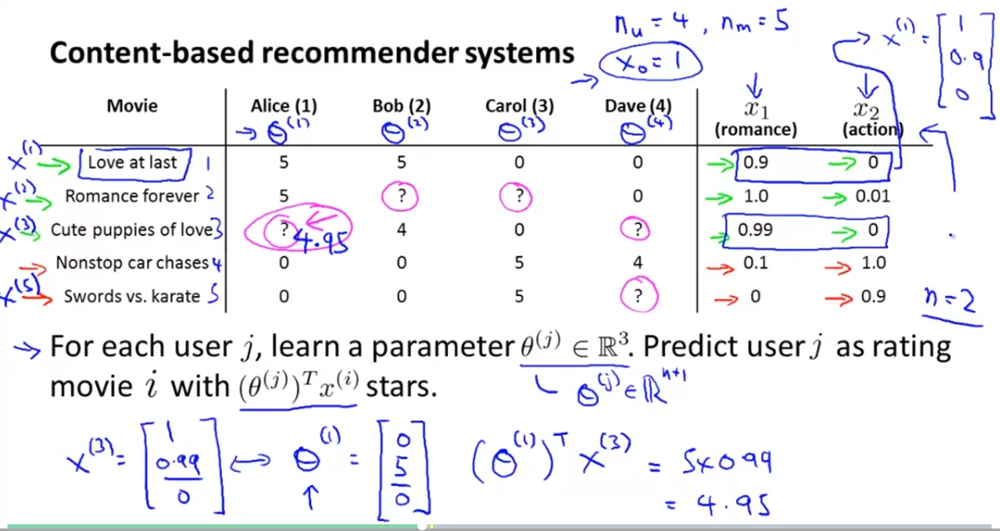
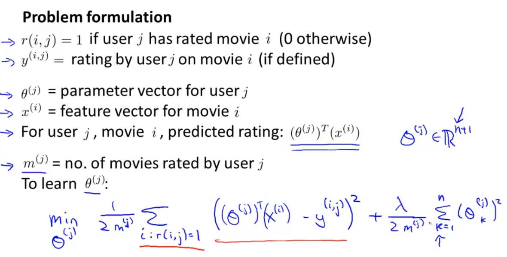
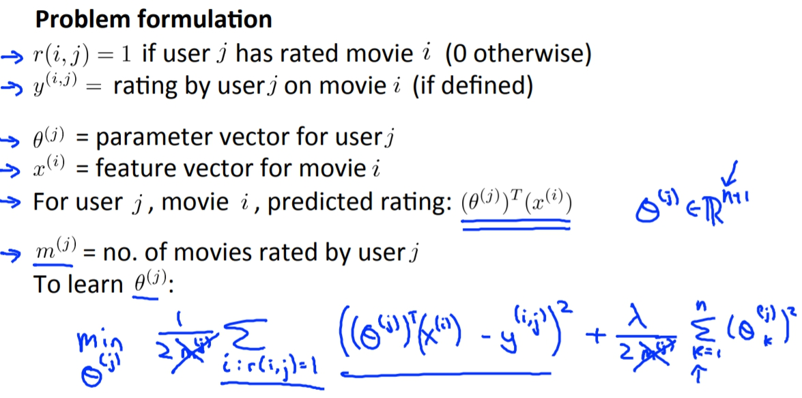
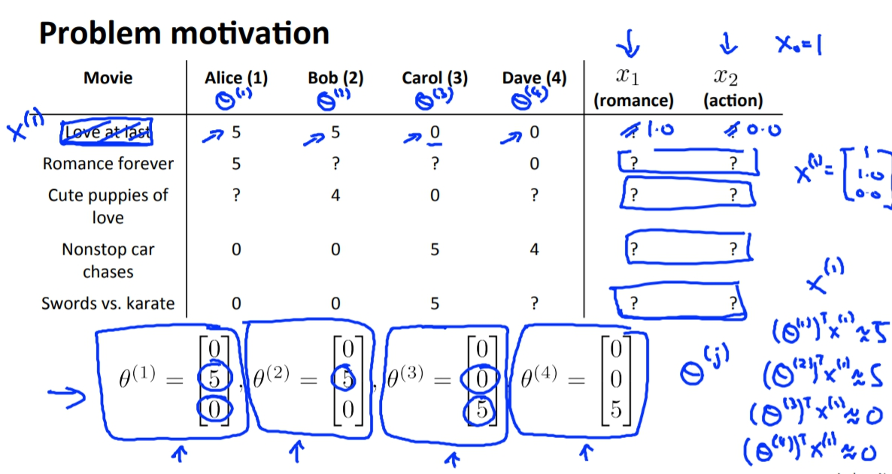
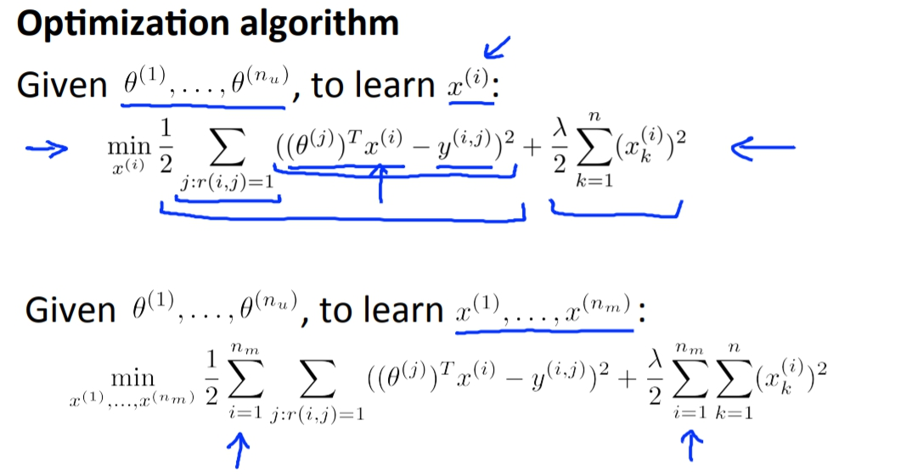
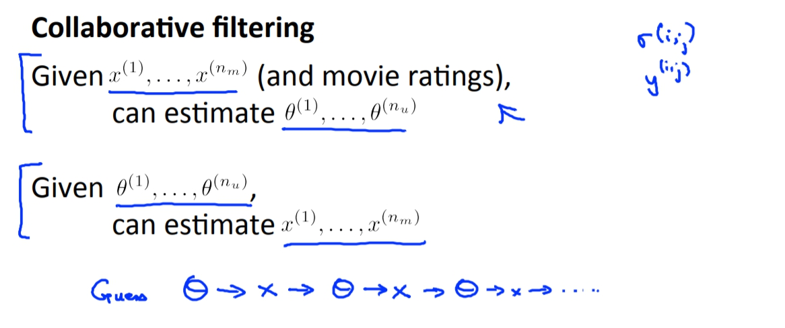
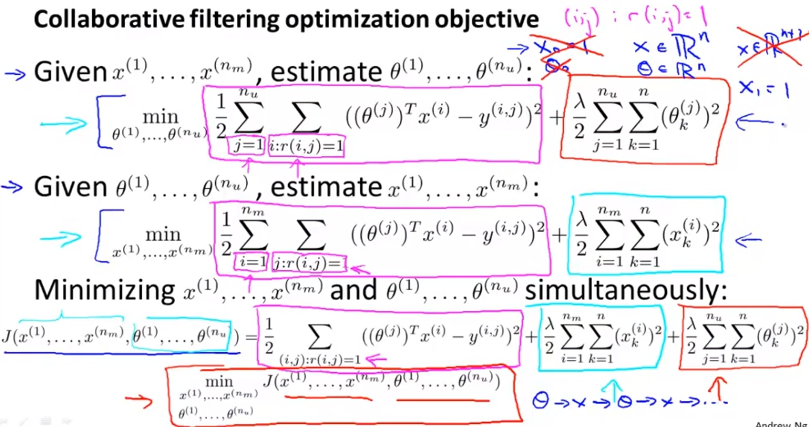
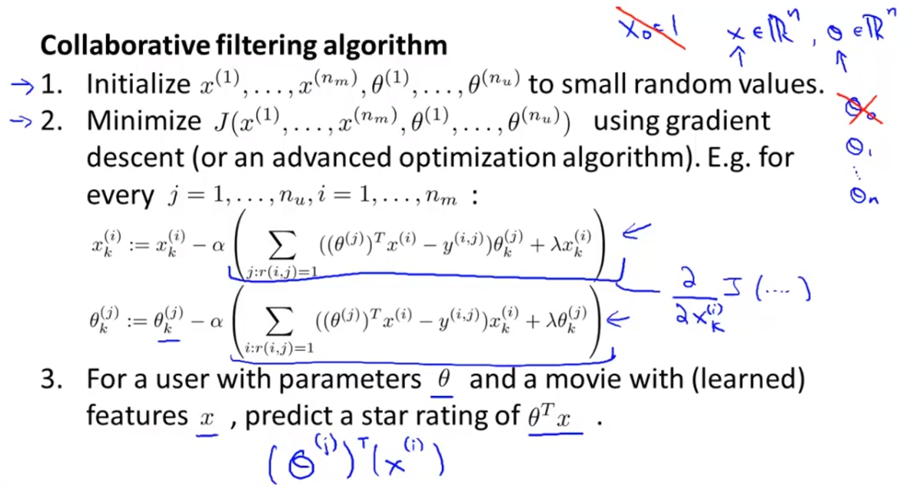

菜雞學ML

## Example: Prediction movie rating
* * *
我們假設說有5部電影並有4位使用者。 
我們可以發現使用者有他們自己喜歡的偏好。那我們是否可以對這個東西來預測使用者喜歡的影片。 
我們希望可以預測出使用者會給這些沒看過的電影多少評價，如果很高的話那我們是不是就可以推薦這些使用者看那些電影。

## Content Based Recommendations
* * *
我們可以建立出兩個feature: romance and action各代表說這部影片的這兩個元素的含量。 
所以現在我們就可以將這個問題使用linear的方式來解答了。 
一樣我們用
`
\theta^{(j)} \in \mathbb(R^{3})
`
來當作需要學習的parameter，並且希望能得出movie i 有
`
(\theta^{(j)})^{T}\chi^{(i)}
`
顆星。

相同的linear problem我們就要定義出他的Cost Function，這裡我們的目標是要希望
`
(\theta^{(j)})^{T}\chi^{(i)}
`
與真正使用者給星的誤差要越小越好，也就是。 
`
min\ \ \frac{1}{2m^{(j)}}\sum_{i:r(i,j)=1} ((\theta^{(j)})^{T}\chi^{(i)} - y^{(i,j)})^{2}
`
 我們也可以加上regularization term。 
`
min\ \ \frac{1}{2m^{(j)}}\sum_{i:r(i,j)=1} ((\theta^{(j)})^{T}\chi^{(i)} - y^{(i,j)})^{2} + \frac{\lambda}{2m^{(j)}}\sum_{k=1}^{n}(\theta_{k}^{(j)})^{2}
`
 我們也可以把m(j)給刪掉因為她是個常數只會影響到最後數字出來的倍率不會對結果有太大的影響，但是如果不刪每個人有不同的m處理起來可能會很麻煩。

再來就可以求出Gradient descent:

## Collaborative Filtering(協同過濾)
* * *
我們前面講到的我們可以用電影的元素當作feature，並使用這些feature來訓練出每位使用者的
`
\theta
`
藉此用來推薦使用者影片。 
但是如果要取得這些feature的資料可能會非常不容易，因此我們是否可以從顧客那邊來求出feature值。 
答案是可以的，但是我們必須要取得顧客自己對不同電影的喜好程度，也就是我們上面所要求出來的
`
\theta
`
，然後再透過一樣的方法使用linear的方式來解出X(features)

但是這樣的話不是有點本末倒置嗎，因為要得到
`
\theta
`
也一定不是件容易的事情。但其實這個的構想不單單只是這樣，如果一開始我們可以隨機產生出
`
\theta
`
然後學習出X，再來我們使用剛得到X去學習出新的
`
\theta
`
，這樣一來一往其實最後可以得到出很好的結果。

## Collaborative Filtering Algorithm
* * *
不過其實我們可以不用這樣一來一往的訓練多次，其實我們只要把兩個和在一起就好了。 
另外需要特別注意的是這邊我們不用再假設說X0或是Theta0了，

這樣會複雜很多我覺得是聰明人的做法，所以如果是不夠聰明的人像是我，其實這個跟一來以往的訓練其實一樣，只是這個少重複算了紫色畫線的地方一次。

### Step
1. 我們一開始就先隨機設定X跟Theta為很小的值。
2. 開始使用gradient descent to minimize Cost Function J(
`
\theta
`
)。

