菜雞學ML

## Learning with large data
* * *
我們訓練model的時候會希望有越多的資料越好，但遇到大量資料的時候也會遇到一些問題。 
例如gradient descent的時候如果我們有一億筆資料，我們每更新一次
`
\Theta
`
就要進行一億次*feature數量的運算，所以當遇到大資料量的話我們可能要將算法換掉或是找一個更高效率的算法來算導數。  
但當我們用大量資料來訓練之前我們可能要問問自己是否其實不用那麼大的資料就能很有效的訓練出model了呢。 
一個很好的方法就是plot learning curve，取得資料量與error之間的關係，來判斷是否需要大資料。 
像是下面的左圖就是當資料越大越能得到好的結果，而右邊則是其實不用到太大就能得到差不多好的結果了。
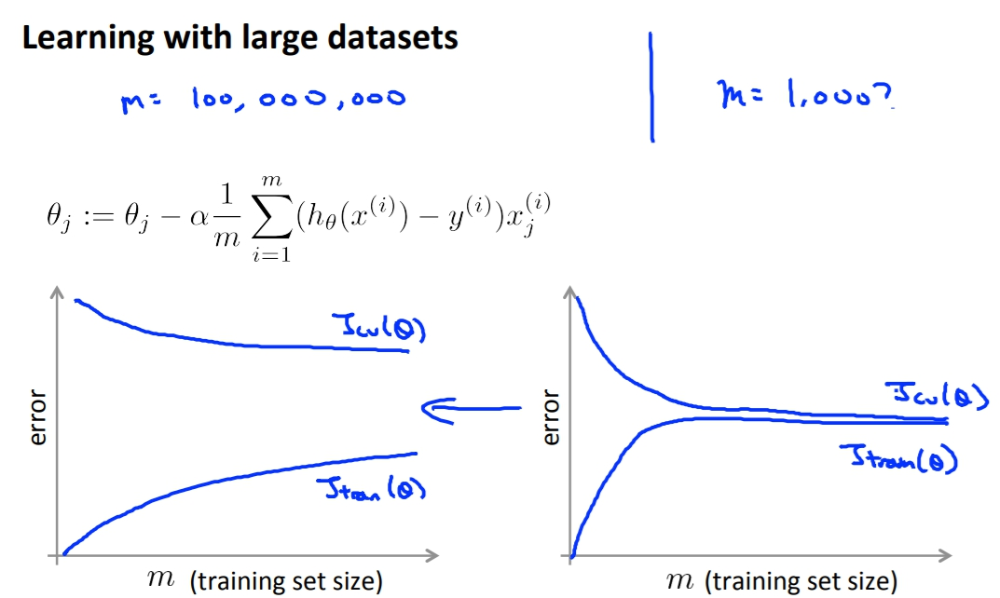

## Stochastic Gradient Descent(隨機梯度下降)
* * *
之前所用的Gradient Descent又叫做Batch Gradient Descent，也就是說我們需要把所有的資料都考慮進去，當迭代的時候必須把每個資料都重新輸入一遍做運算。
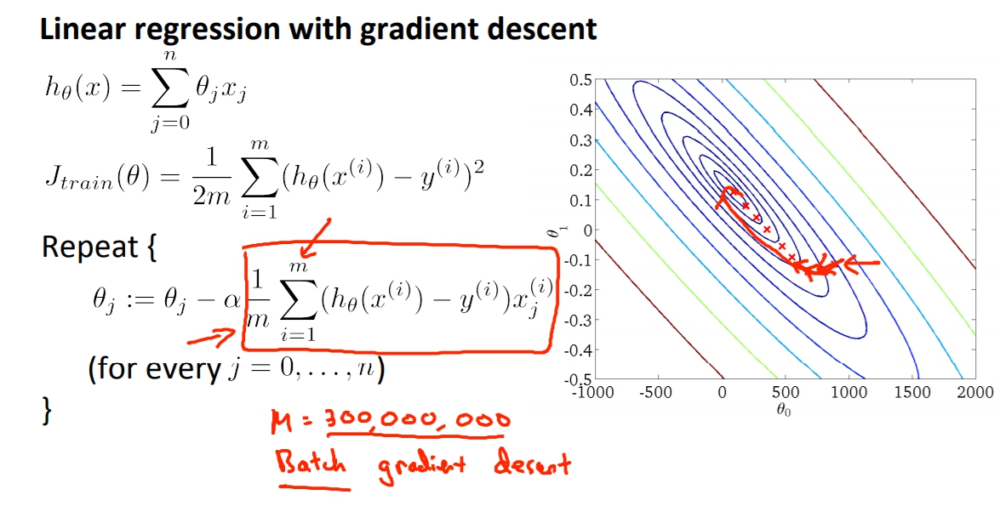
那隨機梯度下降又差在哪邊呢？ 
首先我們將cost function改動，原本的 
`
(h_{\theta}(\chi^{(i)}) - y^{(i)})^{2}
`
 我們改成這樣的寫法， 
`
cost(\theta,(x^{(i)},y^{(i)})) = \frac{1}{2}(h_{\theta}(\chi^{(i)}) - y^{(i)})^{2}
`
 這一步就是我們把cost function看成是單項的x,y而已了。 
所以J也就改成 
`
J_{trai\n}(\theta) = \frac{1}{m}\sum_{i=1}^{m}cost(\theta,(x^{(i)},y^{(i)}))
`
1. 隨機洗亂dataset。
2. 做Stochastic Gradient Descent。作法為下圖右下角。
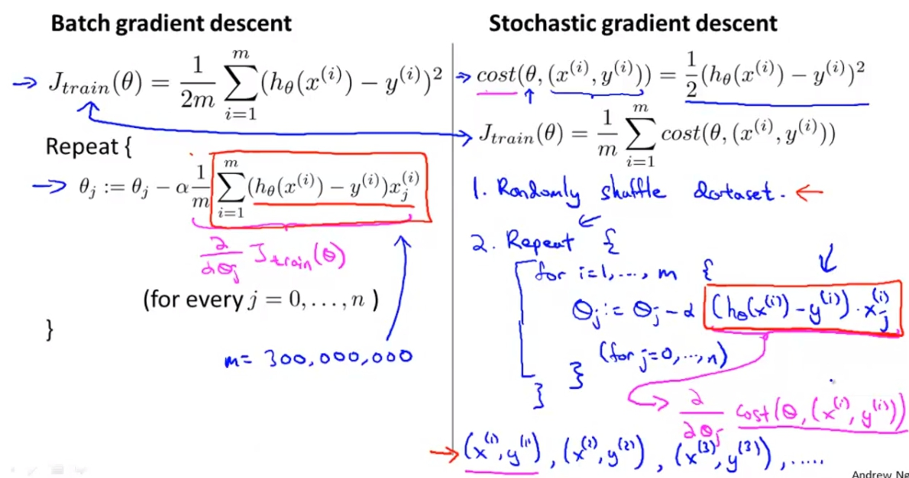
隨機梯度下降做的事其實就是從原先我們要算出所有的 
`
(h_{\theta}(\chi^{(i)}) - y^{(i)})x
`
 變成每次更新一次Theta才算一遍，但這樣不會很不精確嗎，事實上真的不會如batch gradient descent精確。他梯度下降的方向會很不一定，單看正在算的dataset是如何，就如下圖。 
紅色為batch gradient descent，而我們的stochastic gradient descent在第二步的時候轉了個大錯彎。
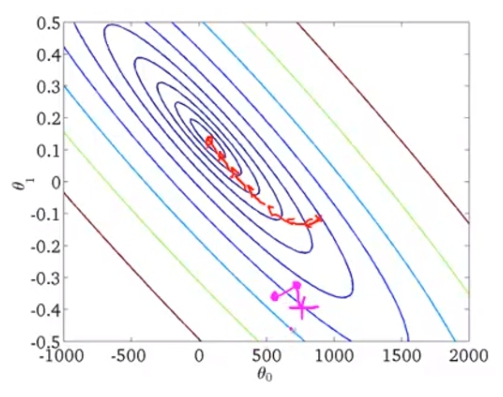
但是終究來說點還是會慢慢往minimum靠近。
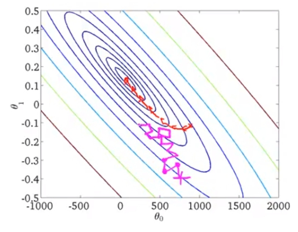
而到了最後stochastic gradient descent不像是batch版本會停留在一個點，stochastic反而會在minimum的附近區域迴繞著。但這個值也已經非常足夠了。
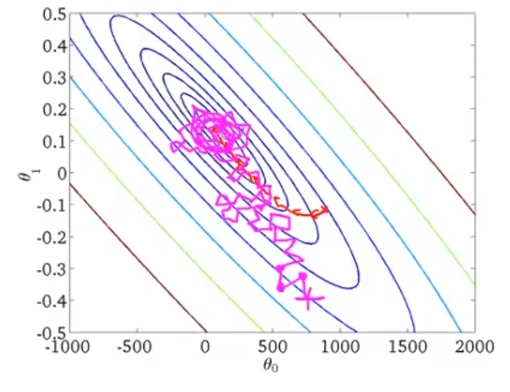
通常執行整個dataset跑一次stochastic就已經很足夠了，最多大概十次，而十次我們也才在batch的版本做十次迭代而已。
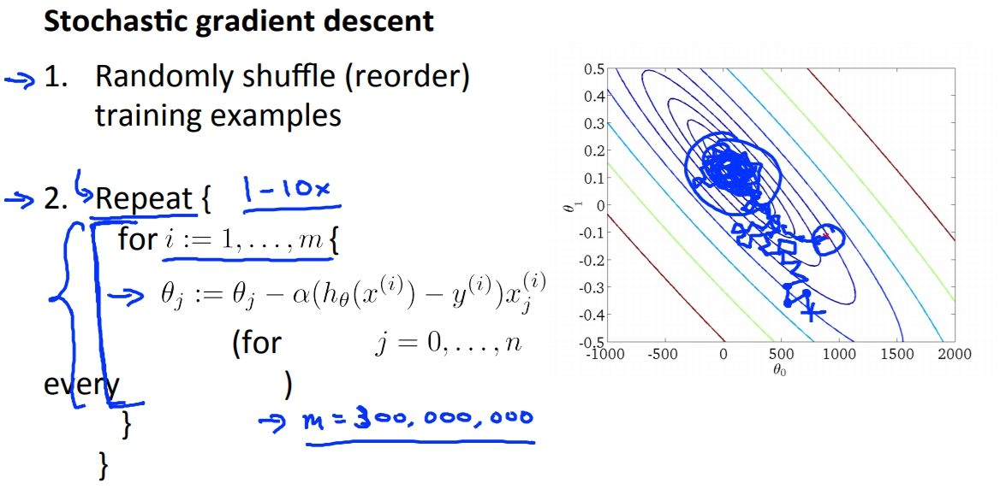

## Mini Batch Gradient Descent
* * *
Bathc gradient descent:我們會用m examples在每次迭代。 
Stochastic gradien descent:我們會用1 example在每次迭代。 
Mini-batch gradient descent我們會用b examples在每次迭代。 
而這個b我們就叫做mini-batch size，大概會在2-100之間。 
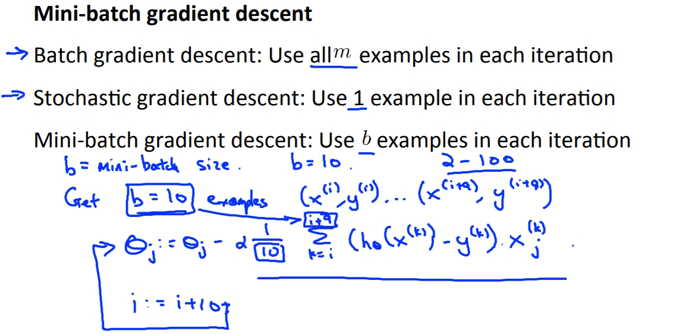
這跟隨機梯度下降不同的地方就是，隨機是一次一筆資料下去算，mini-batch是一次送b個資料進去算，再來再將編號b+1~b+b的資料送進去迭代。 
而mini-batch要比隨機更有優勢的話必須要是資料是可以向量化的，當資料是可以向量化的時候我們可以將b筆資料一起併行處理。
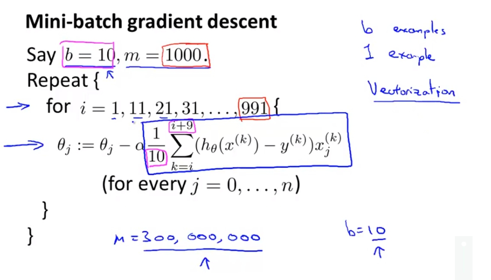

## Stochastic Gradient Descent Convergence(確認收斂以及alpha學習速率選擇)
* * *
一個確認有沒有正確收斂的方式就是plot cost與iteration的關係圖，只要我們看到圖中cost室友在下降的就知道我們的model有在正確收斂。 
一般來說我們不會把每個example的cost都畫出來，而是每一定數字的average。
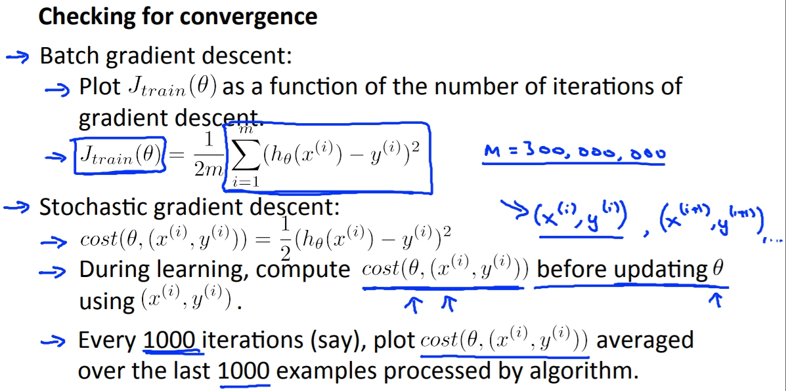
左上：藍色代表較大的learning rate，紅色為較小的learning rate，紅色一開始可能會收斂較慢但是有一定機會可以收斂出比較大learning rate還要好的結果。 
右上：藍色代表每1000筆資料的avg，紅色代表5000筆資料avg，紅色看起來比較順滑但是可能會有點接收訊息的「延遲」，因為你五千筆資料才收集一次，不過還是看個人的選擇。 
左下：藍色為選擇太小的examples avg，可能看起來會沒有收斂，但是如果拉長來看或是選用較多筆資料做avg其實會發現有在收斂。 
右下：如果發現是在發散的話，很有可能是我們選的learning rate太大了。
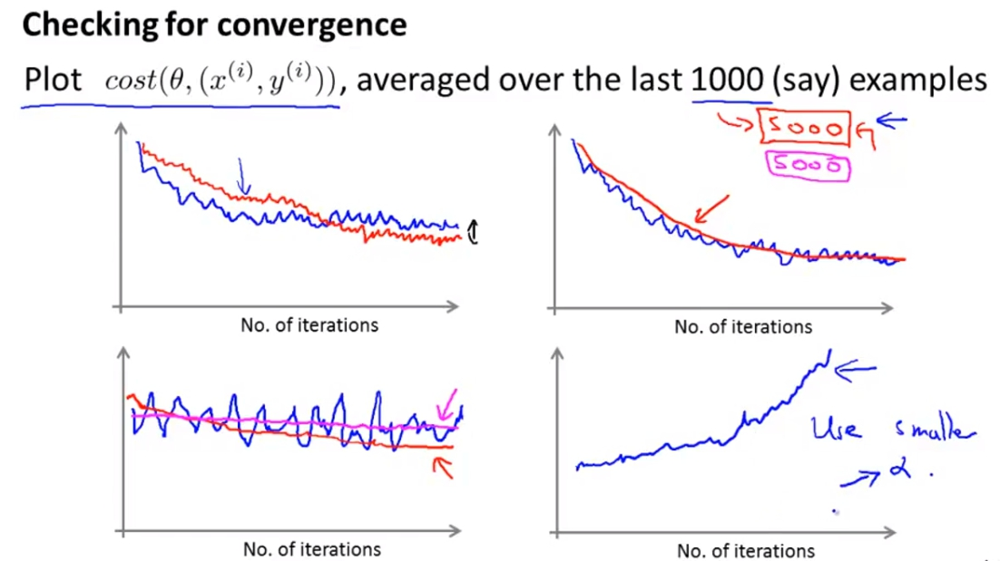

### tuned learning rate
我們也可以隨著iteration來調整我們的learning rate像是下面，當iteration越多我們的learning rate就越小，這樣我們的收斂程度可能就會比較好，因為到最後的地方比較可能會集中在一個點上。
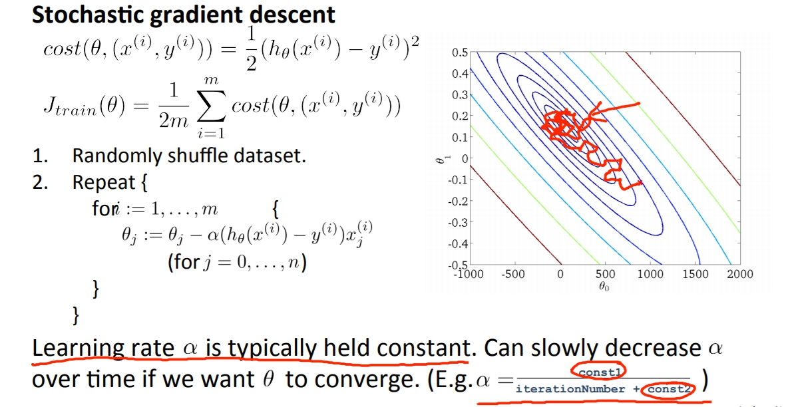

