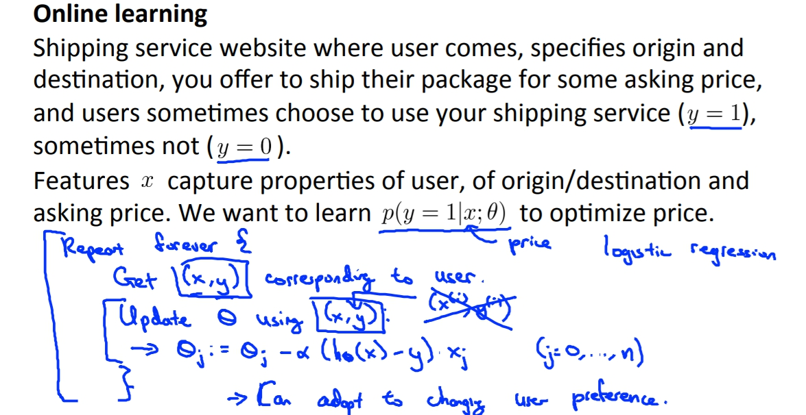
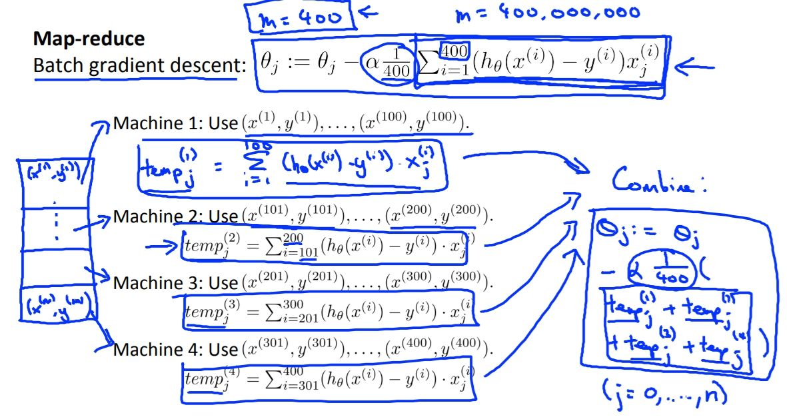

菜雞學ML

## Online Learning
* * *
這個就類似stochastic的概念，預設資料室由stream進來的(因為是網頁的關係)，我們不要一次收集大量資料再處理，反而是向Stochastic一樣一有資料我們就更新一次
`
\theta
`
。

## Map reduce
* * *
這個就很像是mini-batch的觀念。 
我們將資料拆分成不同區段並給不同電腦計算，再來我再將資料整合做iteration。 
以Batch gradient descent為例子，假設我們有四台電腦，我們就將資料拆成四部分去算J的導數，最後再將導數都合併去更新
`
\theta
`

這邊可以適用的演算法只要是其衝可以拆解成什麼跟什麼的和，就都可以套用map reduce這個觀念，將資料拆解運算。

