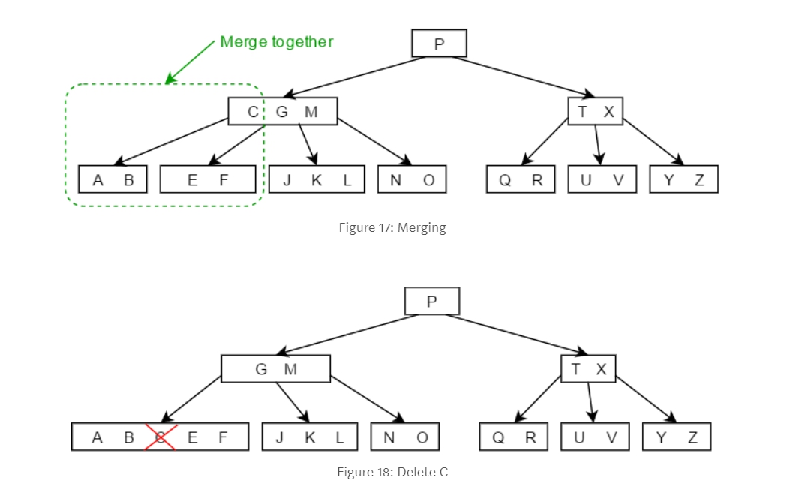

## B-Tree
* * *
一個B-Tree為Degree M(Order M)代表:
1. 每個Node有最多m個children。
2. 一個non-leaf node若有k children代表他有k-1 keys。(因為必須要有k-1個keys才能生出k個children)
3. root最少要有兩個children(代表說root至少要有1個key)，如果他不是leaf node。
4. 所以 non-leaf node(除了root)都至少有roof(m/2)個children。
5. 所有leaf要出現在同一層。
6. Node都會有key的上限與下限數量，上限就會是Degree，而下限通常會是t>=2，又被稱作minimum degree。
  

### Insert value

透過key我們會自行搜尋出能夠放置key的地方，可是可能會遇到兩種情況，第一種是這個node有地方可以放(代表說這個node的key數量小於m-1)，又或者是第二種這個node沒有地方可以放。  
* * *
第一種情況我們會先在每個node看有沒有位置可以放，例如要插入5並且情況向下圖一樣。這時候我們可以放心的插入在4跟10中間。

可是如果是下面這種情況，比4大的地方已經有往下長一個leaf node了。

所以我們變成要插入在10的左邊。

* * *
第二種情況就會啟動B-Tree的特殊機制就是在已經滿的node中選擇中間的數字(若中間有兩個就隨機選一個)來**promote**到node的上一層裡面，並把原本的node分成兩部分。 
像是下圖我們是Degree=3的B-Tree，這時候如果我們要插入6進去的話，會造成[5 6 10]這個Node塞滿。

所以我們會把這個Node拆成左、右兩個並把中間的6 promote上去。

(動畫網址)[https://www.cs.usfca.edu/~galles/visualization/BTree.html]

### Delet value

這裡有很多種情況，假如今天我們要刪除X這個key。
1. 如果這個Key在leaf node且刪掉這個key不會造成這個node不見，漂亮我們沒有對結構造成任何影響，所以我們就直接刪掉。

刪除10。

2. 如果這個Key在leaf node但是我們刪掉他的話這個node會消失這時候我們就改變結構了。這時候我們會下放上層的node key(指標往上看的左邊或右邊的key都可以)，將他降階到下面。 
2-1.  
刪除18，降階17到16的node。

但是如過降階下去遇到node滿了的話怎麼辦，其實就跟insert的時候一樣把它拆成左右後**promote**中間的key到面的node。
 
2-2.  如果左右的兄弟都沒有足夠的key給你的話，我們就必須執行merge。下面的tree定義是每個node不能少於2個key。

Merge成功，刪除B。

3. 如果這個Key不在leaf node，那這時候我們一定有改變到數的結構，這樣我們一定要做些事情。 
3-1. 往左子node找最大值或往右子node找最小值，如果有的話就將他代替自己。

3-2.  如果都沒有的話就Merge左右兩個node再把自己刪除。

## 資料含量
* * *
首先我們要知道一個Node又稱作Block，且Block通常都會有預設的固定大小，這就跟我們Degree可以設多少很有關係。而一個Block裡面又會有，Key(資料鍵)、Data Pointer(pointer指向資料位置)、Chidren pointer(pointer指向children node位置)。
