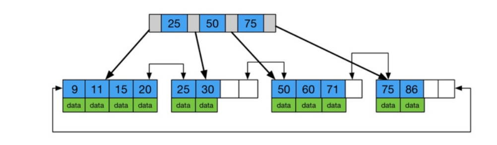

## B+ Tree
* * *
B+ Tree跟B Tree的insert delete機制是一樣的，不一樣的是B+ Tree的資料只儲存在最底下的leaf node，且每個leaf node都有pointer指向相鄰的leaf node以便於資料遍尋。

## B+ Tree vs B tree
* * *
 

|B+ Tree|B Tree|
|-------|------|
|資料儲存在leaf node不在internal node|每個node的key都有data pointer|
|所有leaf node都有pointer指向相鄰的leaf node|只有children pointer|

## B+ Tree與Mysql
* * *
為何Mysql的InnoDB會是使用B+ Tree結構，因為Mysql是硬碟型的資料庫當作存取時會使用到I/O，而大量地使用I/O會導致處理時間過長等問題。 
所以我們會需要盡量減少硬碟IO的次數，而這就跟為何使用B+ Tree很有關係，而這樣做的原因是根據**局部性原理**：

> 當一個數據被使用時，其附近之數據也通常會馬上被使用到。
> 程式運行時所需要用到的數據通常都比較集中。

由於硬碟依順序讀取的效率很高，所以對於局部性的程式使用預讀可以提升IO的效率。 
在B+ Tree中又因為不用在internal node加入data pointer所以我們可以儲存更多的keys，也讓每次讀取一個node(page)的時候都有更有效的搜尋範圍。也因此通常B+ Tree Degree可以比B Tree更低也讓IO存取不需要太多個node。

