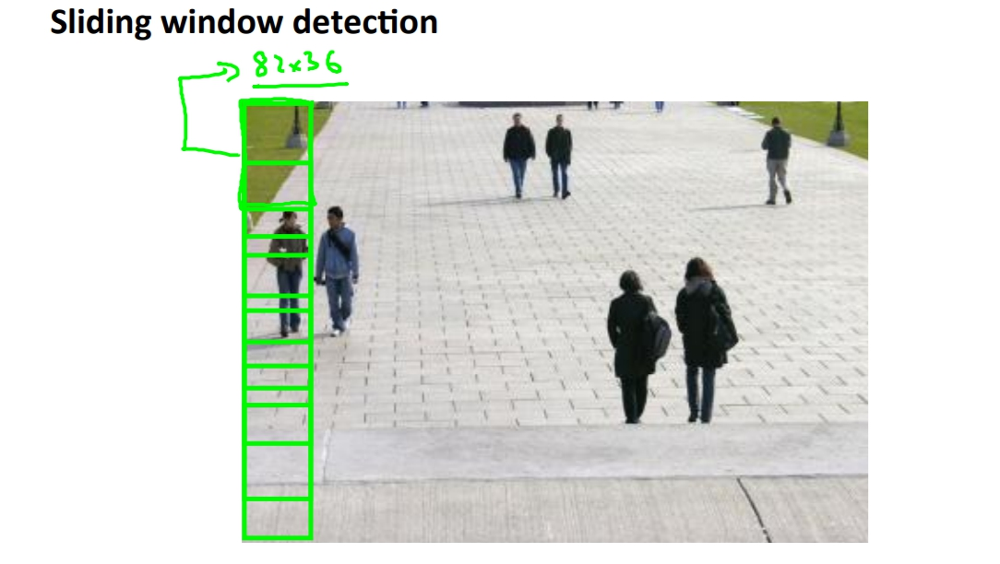

菜雞學ML

## Photo OCR intro
* * *
Photo OCR(photo optical character recognition)中文為照片光學字符辨識，目的就是從片中找出文字以及辨識出文字。 
Photo OCR pipeline:
1. 文字偵測
2. 字母分割
3. 字母辨識

## Sliding windows classifier(滑動窗分類器)
* * *
首先我們先將問題從偵測文字變成偵測行人，因為通常行人都有固定的方形比例比較好做範例。

首先我們先訓練我們的行人辨識器，我們可以找到一堆positive example跟negative examples塞進我們的neural network進行訓練。像是下圖一樣，這邊預設長寬是86x36的灰階圖(用灰階因為資料量小)。

接著我們回到要判斷的圖片上面，這時候我們就要應用到sliding window的技巧，那就是我們先在最左上角取一個長寬比例是86x36(這樣才容易轉換成86x36)的方框，一開始可以小一點。並且從左上角開始向右取每一個格子塞進我們訓練好的辨識器裡面看是不是行人，如果是就標記起來。然後掃完全部圖片後我們可以放大格子或是縮小格子繼續搜尋(因為行人遠近不一)，這樣掃過幾次後就可以框出行人了。

但是記得最後都要把它縮放成86x36才能塞進辨識器。

再來焦點換成文字了，一樣我們先拿出很多樣本去學習文字的分辨器。

接著一樣透過sliding windows我們去選擇出那裡是有文字的，但是這裡有個問題是我們選擇出來的成果可能會像是下圖的左下角，我們不太知道如何去框選出適當的地方。 
這時候我們可以將白色的部分「發胖」，讓他跟附近的白色和在一起，我們在挑去掉比例不合(字通常都是寬扁)或大小太小的白色區塊，最後劃出框線。

再來我們在訓練出判斷是否有字跟字之間空隙的辨識器。 
然後再透過sliding windows去框出框框，判斷是否有空隙，有的話就分割。

## Artificial Data Sybthesis(人工數據合成)
* * *
如果我們已經有一個low bias的分類器那我們可以考慮說需要更大量的資料來訓練model，這時候我們就可以思考使用人工數據和成，透過一些方法來擴增dataset。 
以字母判斷來說我們有兩種方法可以擴增dataset，一種是用不同的字型去建立資料，通常會有很多字型可以使用，另外一種是透過加入一些聒噪或是變形來生成新的dataset。

在決定增加資料前我們可以思考幾個問題，第一個是我們這樣增加資料是否對model是有幫助的，如果現在遇到的問題是high variance的話我們可以透過正規化去解決而不是增加資料。 
第二個是增加資料的難度如果要增加資料很難的話可能會很尷尬，但是如果其實增加資料不難我們可以增加很多資料。

## ceiling analysis
* * *
這是一個判斷哪邊需要改強的技巧，我們可以設定讓某個區塊是預測100%正確，再來看這對最後的準確率有提高多少，如果有顯著的提升代表說這是很值得下功夫的區塊，如果是沒有提升的話代表說這邊不管你做得多好都差不多。

