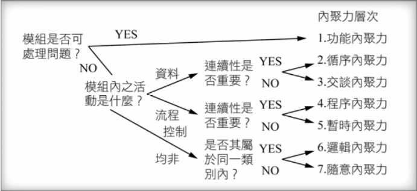

在網路上看到的有趣東西，目的在於評估一個模組。 
## Cohesion 內聚
* * *
內聚簡單解釋就是將執行某個功能的所有資料、function全部包進一個模組裡面(function, class, package等等)，讓這個模組具有自己可以獨立運作的功能。如果該模組越不需要依靠其他模組運作，代表說這麼組的cohesion很高。

## Coupling 耦合
* * *
耦合就跟內聚相反，假如這模組需要跟其他模組有關係(可能使用global variables或是需要其他模組當作輸入值)，這就代表這兩個模組互相耦合。
  
做軟體基本上我們會希望設計出的模組都是**「高內聚，低耦合」**。因為高內聚的模組代表它具有獨立性，可以被**單獨使用也可以被單獨修改**。能夠單獨使用代表說這個模組的「使用率」可以升高，因為他不用到處依賴。而能夠被單獨修改也就代表工程師可以大膽地修改模組也不用擔心會引發**「漣波效應(ripple effect)」**。
  
但是我們也很難寫出超高耦合的模組，因為超高耦合可能會有些問題，例如說我們為了獨立一個模組把大量的東西塞進去，結果導致模組有一萬行程式，這就有點本末倒置。 

## 內聚性的型態
* * *
內聚性其實是一種非量化的量測，我們可以利用型態來確認code的內聚性種類來評測。內聚分類如下，並依內聚程度低到高排列。

|內聚性種類|描述|
|---------|----|
|偶然內聚性(Coincidental choesion)，內聚最低|偶然內聚性是指模組中的功能是剛好放在一起的，彼此之間沒有太大的關係只是因為放在一起而產生內聚性。|
|邏輯內聚性(Logical choesion)|邏輯內聚性是指模組內的功能是因為邏輯上分為同一類而被放在一起，功能之間還是沒有太多的互動也有可能功能之間有很大的差異，例如像是將滑鼠與鍵盤的功能放在同一個模組裡面，只是因為都是輸入的關係。|
|時間性內聚性(Temporal choesion)|時間內聚性是指將容易在同一個時間點發生的功能放進同一個模組裡面，例如說在接收錯誤的模組裡加入錯誤日至、攔截錯誤、通知使用者等功能|
|程式內聚性(Procedural choesion)|程式內聚性代表說模組裡面是一組會依照順序執行的功能，例如像是模組中有檢查檔案權限再來有開啟資料夾。|
|資訊內聚性(Communication cohesion)|資料內聚性是指將處理同樣資料的功能放進同個模組裡，例如處理固可資料的模組。|
|依序內聚性(Sequential cohesion)|依序內聚性是指模組內的每個機能的輸出資料會是下一個機能的輸入，就像工廠線一樣依序下去。|
|功能內聚性(Functional cohesion)，內聚最高|功能內聚性是指模組中的每個機能都對模組中的單一明確任務有貢獻。沒有機能是在做不相關的事情，例如讀取交易紀錄的模組中的機能就是為了要讀取交易紀錄。|

