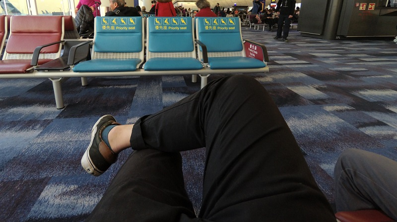
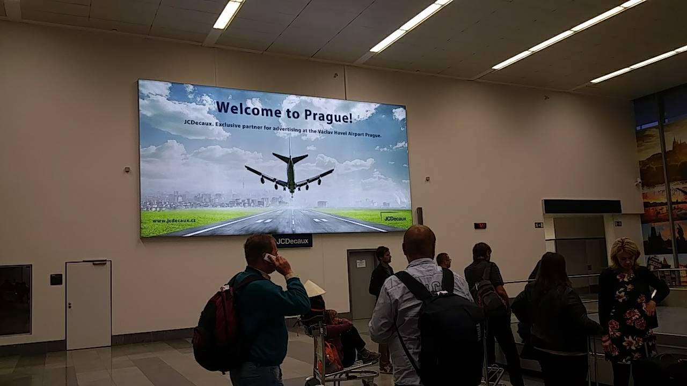
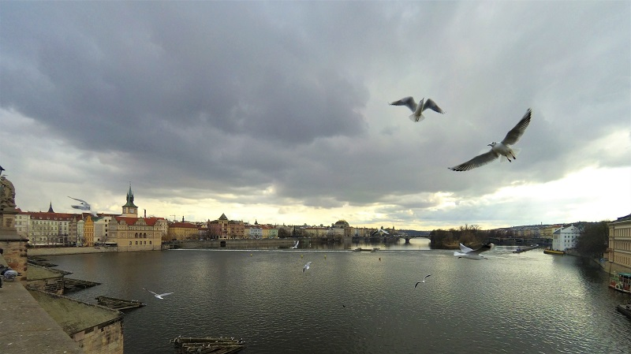
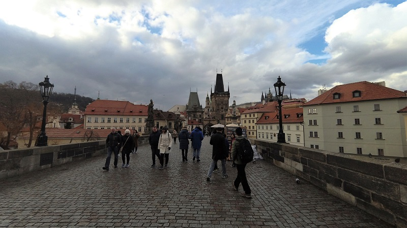
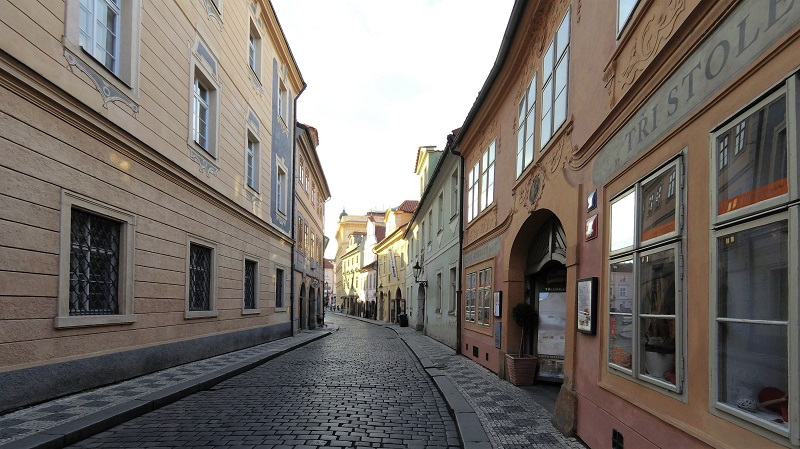

### 漫長的路途
* * *

這次從台灣到香港，再從香港到杜哈，再從香港到布拉格。一路上沒有特別的波折但卻依然的疲勞，搖晃的飛機搭配著美麗空姐就好像為這漫長交換之旅寫下序章，有令人擔心的阻礙也有令人期待的事物。 
就這樣經過20小時順利到達了布拉格機場。

### 期待與落空
* * *
首先必須感謝各位自願擔任buddy這項計畫的學生們，他們是捷克理工大學的學生們但是卻願意抽空出來為我們接機或是處理一開始的一些雜事等等，令人非常感動。 
 
一開始以為會是跟台科的另一位交換生住在同一間房間，一直都這麼想的我直到打開房間的門後才希望破碎。不過還好的是室友是一位人非常好的加拿大魁北克省人，他有點像是這大房間的宿館，有良好的衛生習慣跟禮貌，真是謝天謝地。
  
另外我完全低估歐洲人愛喝啤酒跟愛開趴的程度，每日大喝跟每日開趴對他們來說根本是家常便飯。有次還有一對人在房間外開趴，直接喝爆然後撞進我房間裡面，真的是扯到讓我眼界大開。

### 唉呦真的太美
* * *
布拉格這城市的美麗程度真的令人難以想像，這座古老的城市經過了多少風風雨雨多少貴族的興起與衰落造就了如今的布拉格。遍地的美麗建築盡收眼底，坐落於山上的城堡更是令人駐足。

