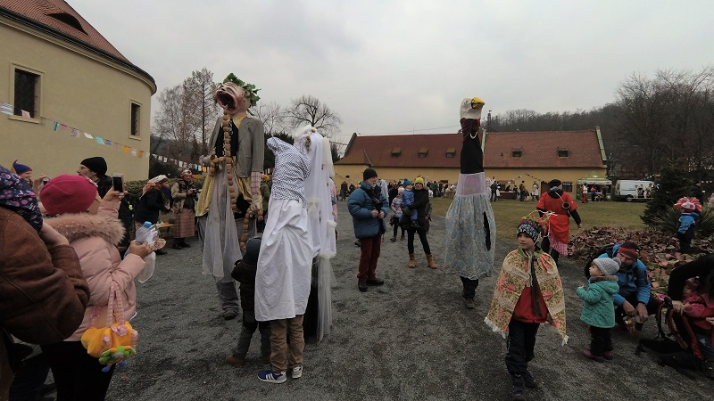

## 有趣的小慶典
* * *
要了解一個國家的風俗民情就從他們的慶典開始瞭解起，捷克是一個很晚才獨立建國的國家，但卻已有非常豐富的歷史文化。這個慶典是斯拉夫人的傳統慶典，在捷克叫做Masopust。
 
 
在活動當天，有許多各式各樣的表演，有樂團的表演、有各式裝扮的人們遊行、有話劇表演、有各式的捷克食物。最後慶典會開始遊行，中途行經兩站，一站表演、一站跳舞、最後到達一個馬戲團。
 

 
活動中可以看得出捷克人對於生活的一些態度，對於及時行樂、不急不徐的生活原則是我們華人比較難以理解的。對於他們大多數歐洲人來說，生活就是必須與樂趣互相交織。不用去趕進度、不用加班。禮拜日不想開店，那就都不要開店吧。不像華人般汲汲營營。

<iframe src="https://www.youtube.com/embed/2YKcPE17X3M" frameborder="0" allow="autoplay; encrypted-media" allowfullscreen></iframe>

