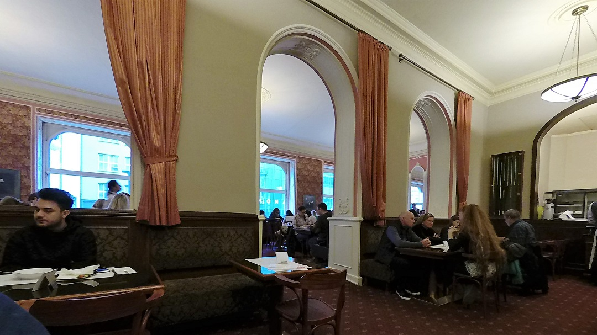
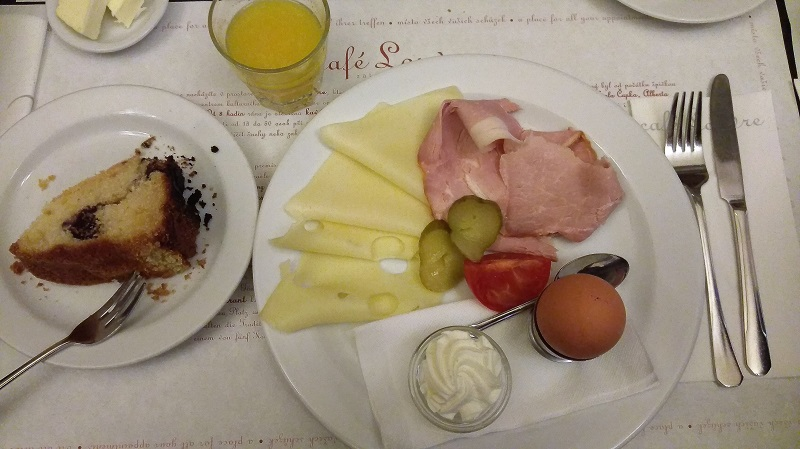
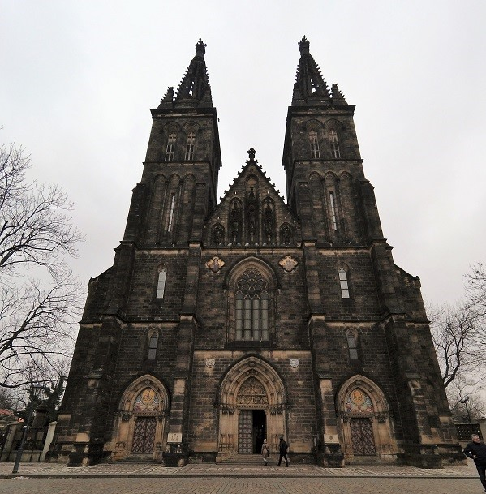
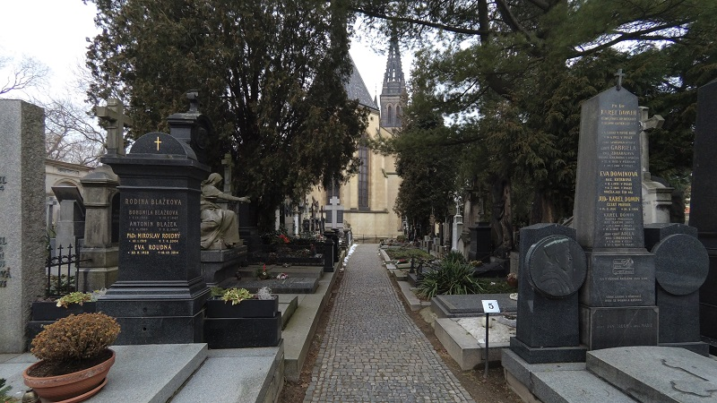
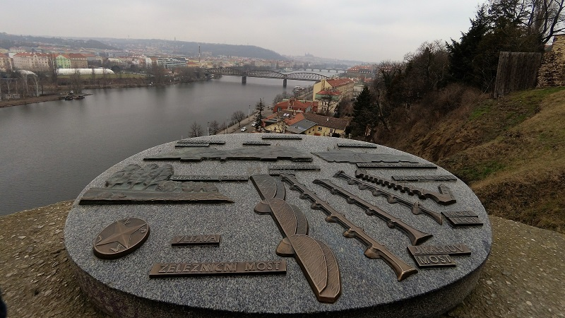

### 百年咖啡店-羅浮咖啡
* * *
這間擁有百年歷史的咖啡廳，令人印象非常深刻的是他完全不會太貴的價格。一般有個小名氣的台灣咖啡廳都開始亂喊價，這裡的咖啡也都不過100左右。早午餐也差不多200台幣左右而已，難怪可以生存百年之久。

### 布拉格-高堡區
* * *
這城市令人著迷的美景散落各地，這次感謝學姊的邀約來到這美麗的高地。在這山丘的城堡中有座雄偉的教堂跟高堡公墓，有許多捷克的有名人士葬於此地，但身為文化小白癡的我完全不知道誰是誰。不過還是靜靜地繞了一圈，感受一下當地人對於這些名人的敬愛。
 

 