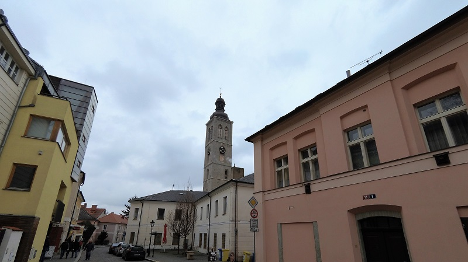
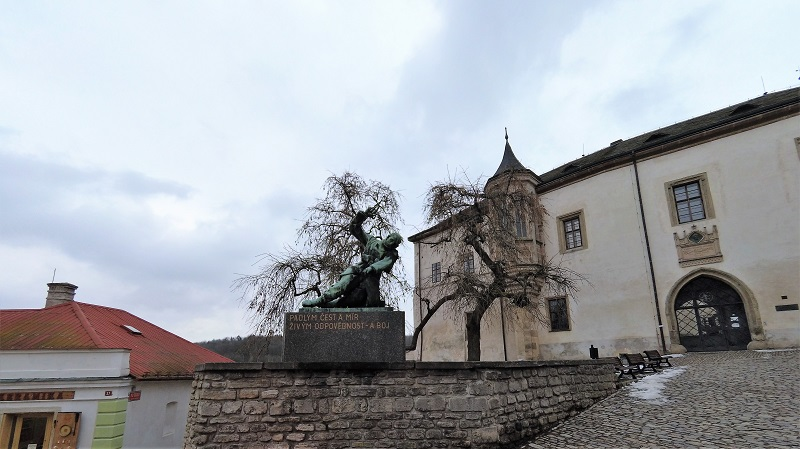
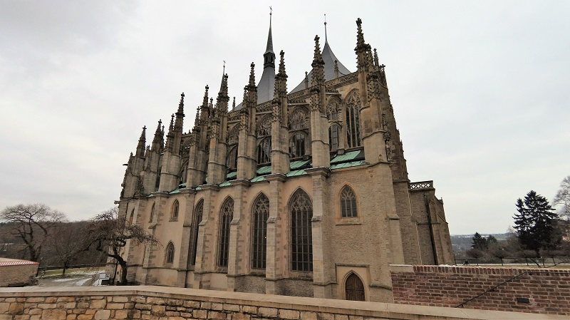
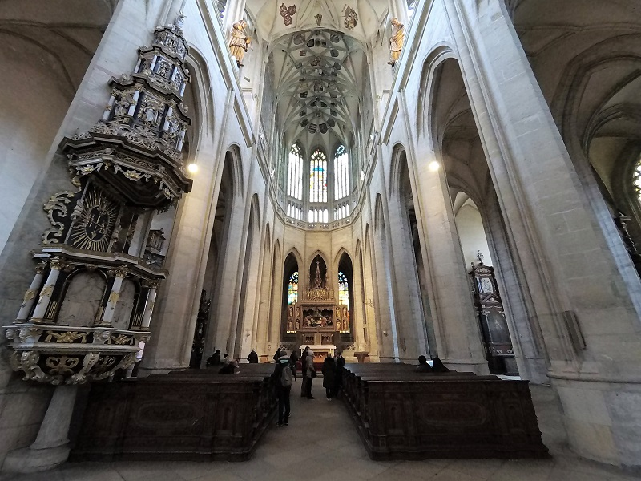
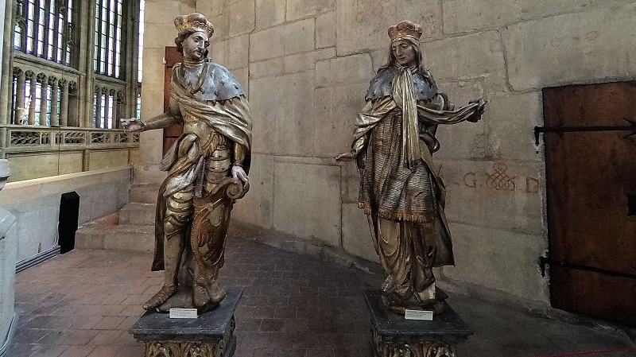
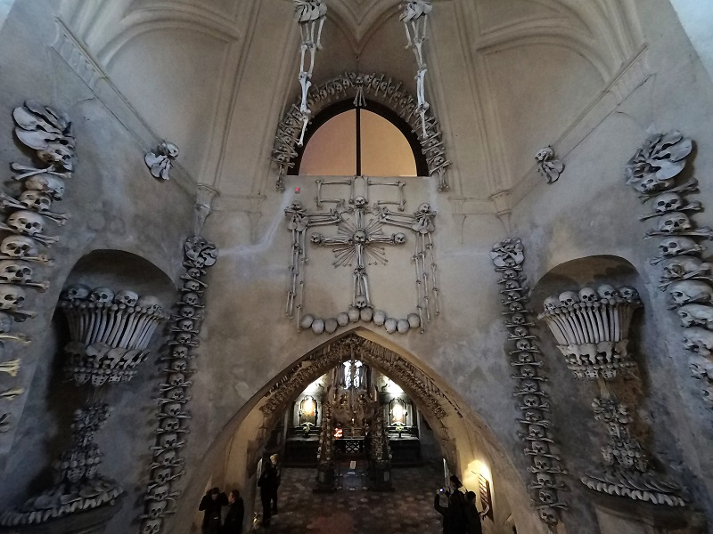
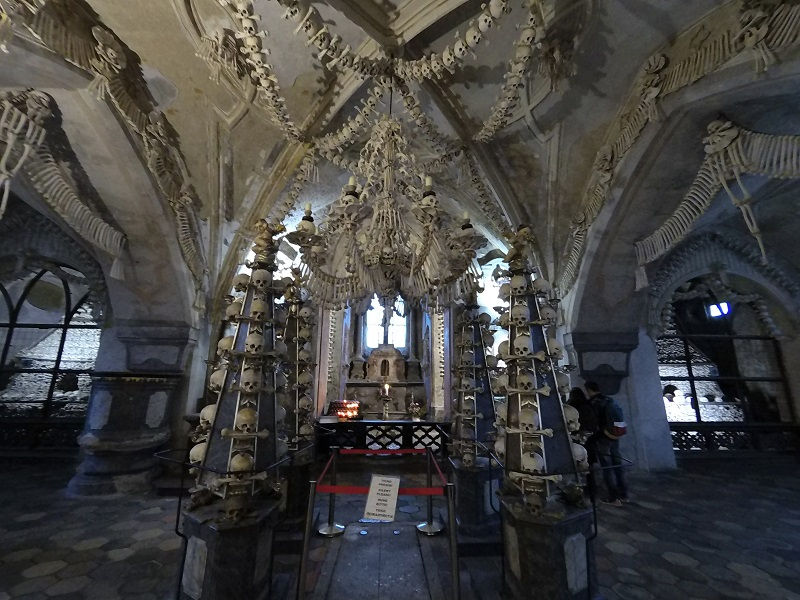
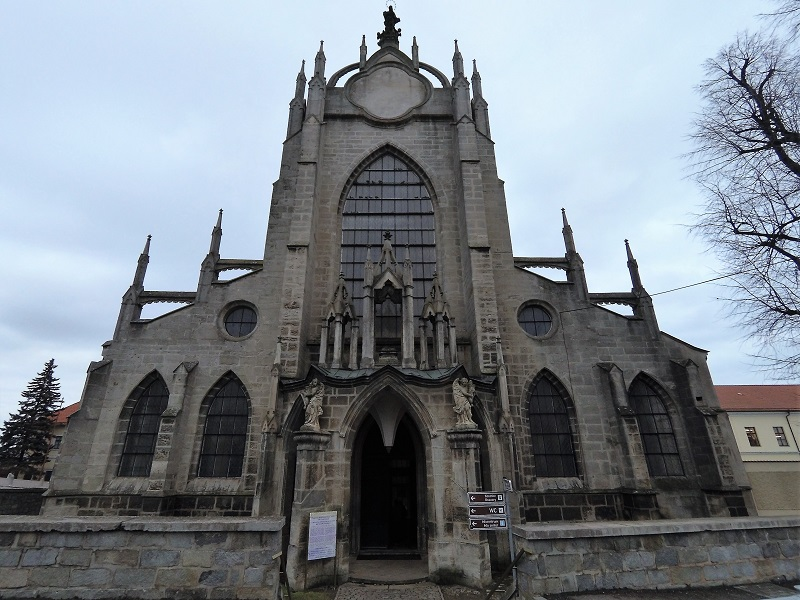

### Kutna Hora 小鎮
* * *
在13世紀有人在這個小鎮發現了銀礦，因此成了波西米亞中最富裕的城市之一，各式各樣的金屬行業都非常興盛，也吸引了大量的人口移入。
 

 
然而在15世紀時發生的胡思戰爭波及這個小鎮後，造成這小鎮開始慢慢落寞，到現在只剩2萬人口的小鎮。

### 聖巴巴拉教堂
* * *
在1388年因為小鎮的興盛而決定興建比原本大2倍的教堂，然而卻遇到15世紀的胡思戰爭導致停工60年。復工後卻因為銀礦產量下降出現資金不足的問題，因此直到19世紀才完成。

### 人骨教堂
* * *
因為人口爆漲、胡思戰爭、黑死病，導致墓園的大小不足，在16世紀時有個半盲的教士開始把骸骨搬進教堂，並堆成金字塔狀。但因為數量實在太多，1870又有人開始將骨頭做成裝飾品，成就了今日的人骨教堂。

### 聖母升天與聖若翰洗者教堂
* * *
沒進去到，因為關了哎呀呀。

### 哎呀
* * *
捷克真是個充滿歷史痕跡的國家，各種文化的色彩都在這地方留過痕跡。就算戰爭洗禮過此地無數次，有多少不同的民族佔領過此地。這裡的一些城鎮卻還是像寶石般閃閃發亮，雖然有些斑剝褪色不再如以往般散發光芒，但只要手輕拂而過推散表面的細灰，那隱隱閃著的亮光依舊深藏在其中。未來再去其他的國家看看不同城市的美麗。