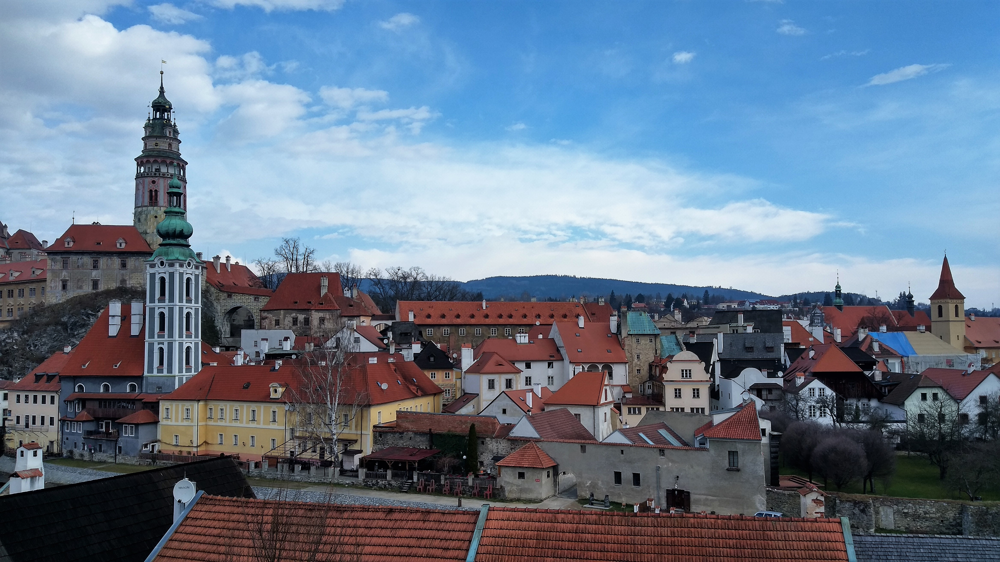
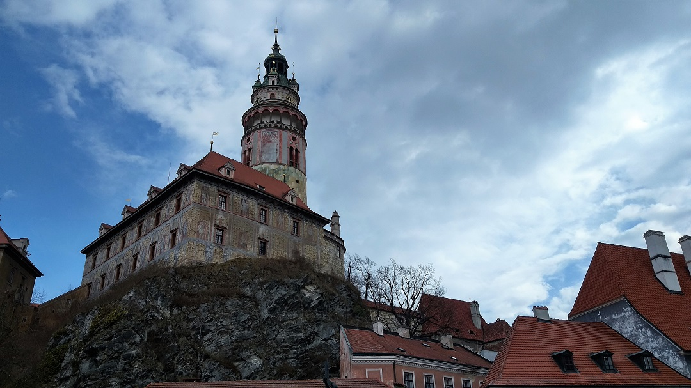
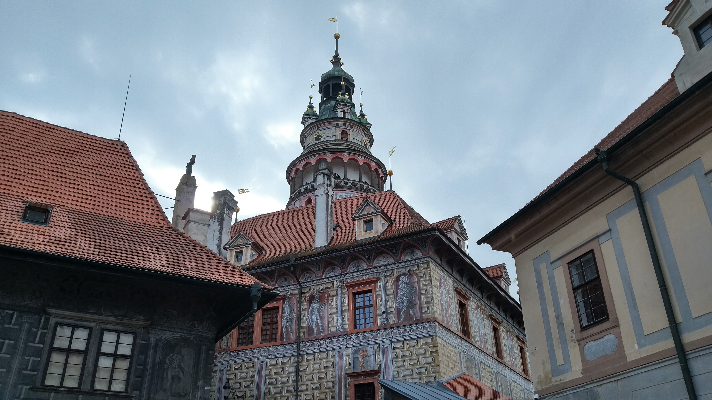
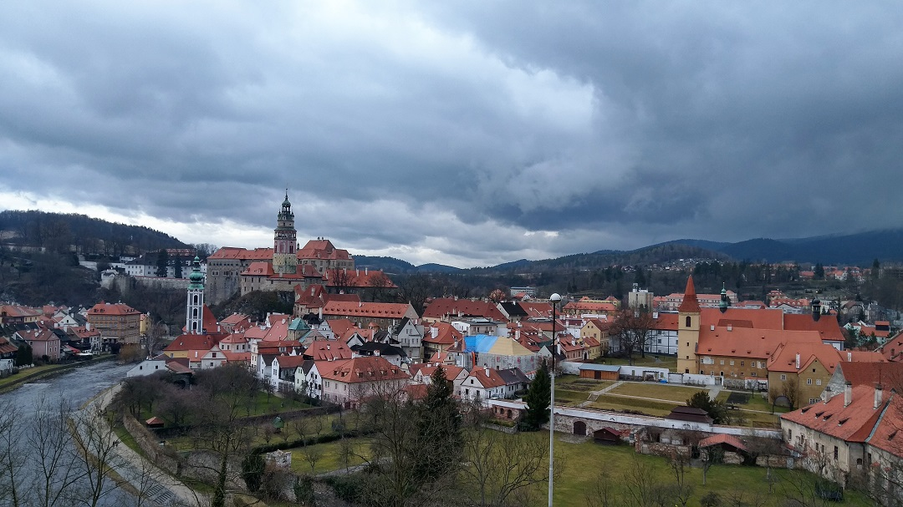

## 童話中的小鎮 Cesky Krumlov
* * *
趁著復活節假期來到非常期待的CK小鎮，這是個建築物保存十分優良的小鎮。這裡有著除了布拉格城堡外最大的一個古堡，還有著許多美麗的歐式小鎮建築。 
可惜這次來的時候剛好遇到陰天跟小雨讓照片看起來有些陰暗，不過這小鎮還是有著自己獨特的氛圍。CK小鎮特別的是有一條小河蜿蜒著小鎮外側像是從好幾百年前就在擁抱片土地一般，而Krumlov源自於德語的「高低不平的小鎮」也充分的表現出這小鎮特有的地形。

這座很顯目的塔就是整個CK小鎮的至高點，塔外牆面有著許多顏色鮮明的繪畫，只要爬上這座塔就能俯望整個CK小鎮。

但CK小鎮真的是太小了整個城鎮我們大概花3~4個小時就完全逛完了，另外這邊也非常多的華人旅行團，不知道是不是因為部落客的相繼介紹導致這邊幾乎都是台灣人跟大陸人很愛的景點。甚至好吃有名的餐廳都塞滿了人，預約也都到下午三四點，可說華人數量真是好棒棒呢。
