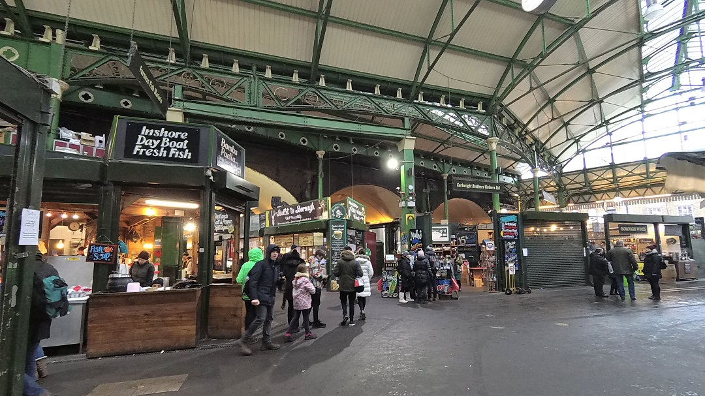
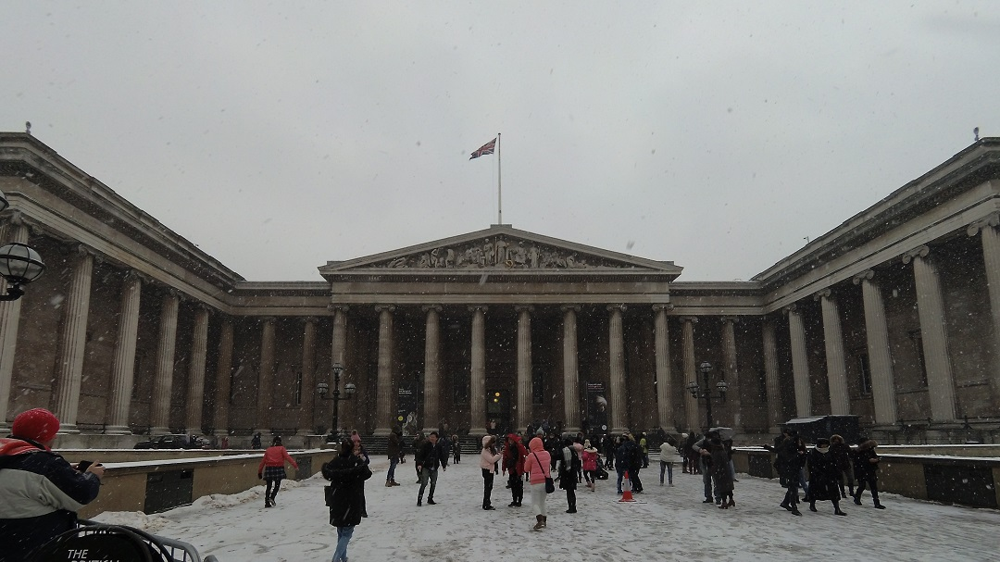
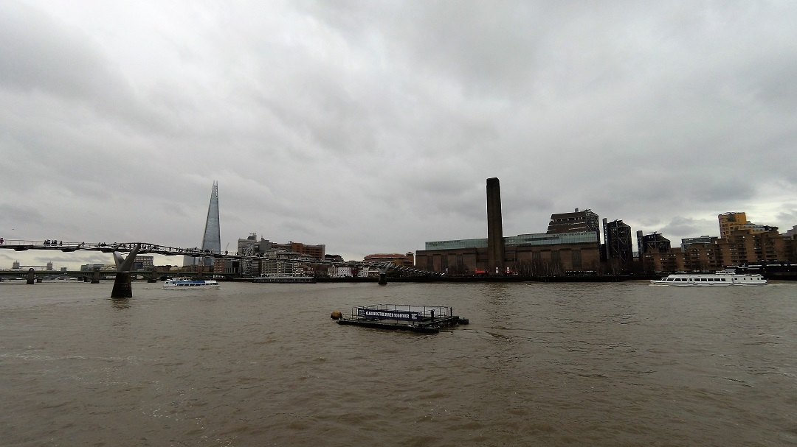
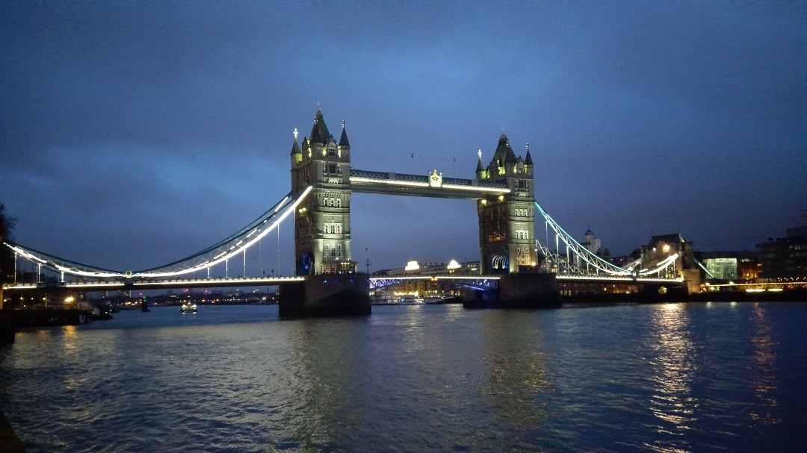
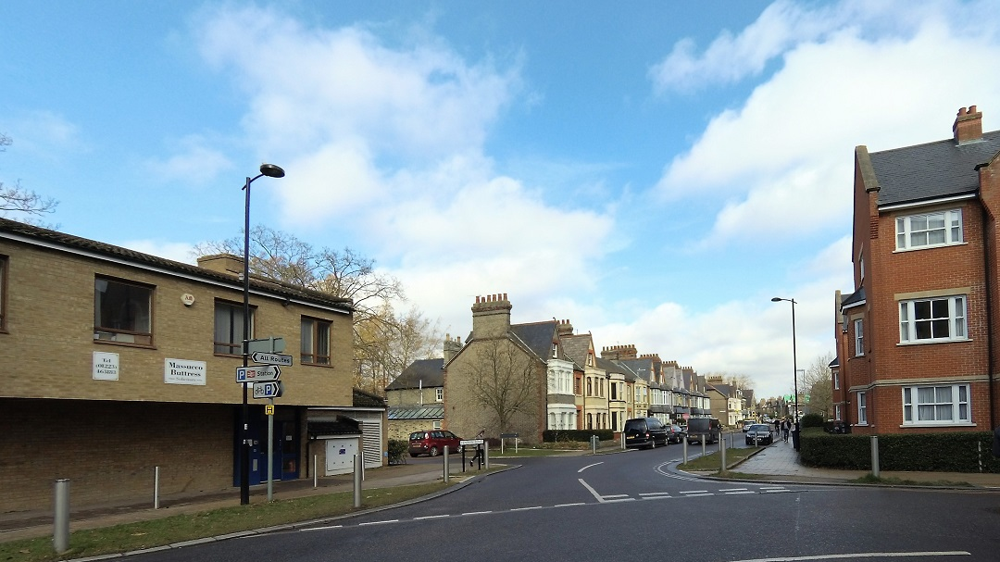

## Day 1 & 2
* * *
一落地就很不幸地遇到倫敦罕見的大風雪。路面的積雪讓原本就已脆弱不堪的倫敦交通更加水上加霜，憤恨的情緒充斥著馬路與鐵軌，沒有一個交通工具可以準點。大家拖著疲憊的身軀一一步上人滿為患的火車，準備從郊區的機場回到繁亂的市中心。
 
 
一開始以為倫敦的天氣不會像布拉格這麼的寒冷，沒想到卻像是台灣的濕冷，雪下到衣服上化成水讓原本的寒冷又更加痛苦不堪。這兩天大家也都沒什麼活力的盡量踩點。
 
 
### Borough Market
* * *
倫敦有幾個有名的市集，Borough救世主打吃的市集，但是不知道是太冷沒什麼人還是我們有點太晚來了。到那邊的時候就剩下沒多少攤位了。
 
 
但依舊是個非常有特色的市集呢~

### 大英博物館
* * *
大英博物館一直是我非常期待的景點，博物館也沒有讓我失望，許許多多的特色館藏。幾乎歐洲、中亞、北非的各種東西都可以在這邊看到。但這些東西有很大一部份也是透過不法、戰爭等手段來奪取甚至是搶走，其中甚至有將希臘聖殿的一大片雕塑完全帶走，或是直接將代表性墳墓整座搬來，讓這些令人歎為觀止的館藏都蒙上一層陰影。

## Day 3 & 4
* * *

### 鴨肉鬆餅
* * *
在40層樓的高空吃下午茶會是什麼感覺呢？
 
歐 原來是荷包心痛的感覺啊

### 泰晤士河散步 & 倫敦鐵橋
* * *
趁著其他小夥伴逛街的時候來泰晤士河散步散步，從柯芬園走到倫敦鐵橋。

## Day 5
* * *
最後一天我們往北走，到了劍橋這美麗的地方。剛好天氣很好，讓最後一天的旅行完全不會覺得可惜，反而格外的開心能在英國看到太陽。

