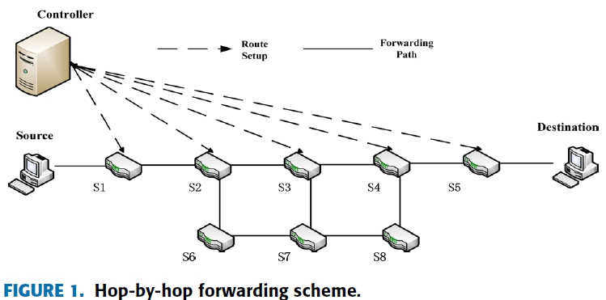
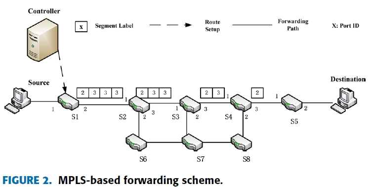
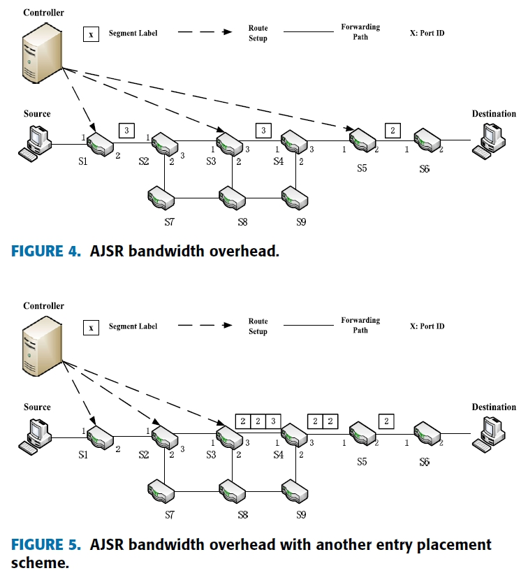
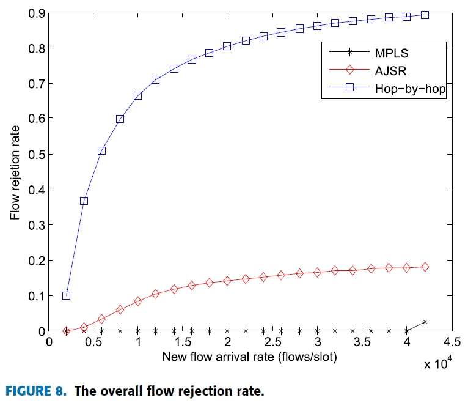
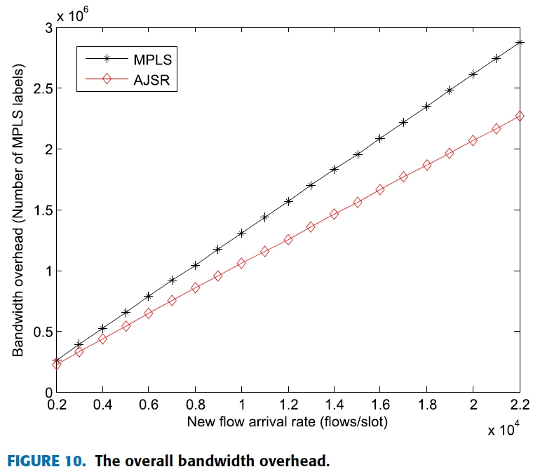
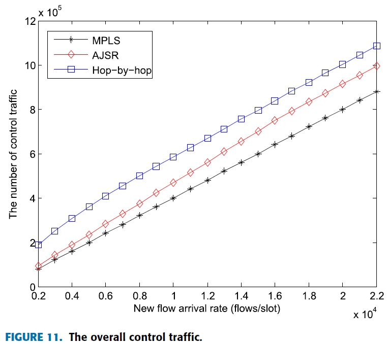

## 大綱
* * *
當SDN部署於WAN(wide area network)時若照著原始openflow的架構，使用hop-by-hop的方式進行封包路由。
會造成在重要節點(有大量封包會經過的節點)出現大量的flow entry進而塞爆整個flow table，導致新的flow無法被正確的加入進table中，而封包遭到switch的丟棄。
 
為避免此種情況發生，可以將flow entry只加進ingress switch中，並使用編碼的方式將完整的路由路徑給編碼在封包中(如MPLS)，如次可以減少甚至消除在重要節點會出現的flow table爆掉的問題。但是此種作法也會造成**bandwidth overhead**的增加(因為封包被加入大量的路由資訊)，而此篇論文就是意圖找出能夠在trafic overhead以及bandwidth overhead之間能做出取捨，進而找出最佳化的解。

## 論文核心
* * *
原始的openflow所進行的方式為，在每個switch中加入flow entry的方式。
 
而MPLS的方式為，只在ingress switch中加入flow entry並在ingress switch中進行編碼，將路由的資訊加入進header中，由接下來的switch透過header來進行封包的轉送，而不必透過flow table的查詢，此方式不但能減少flow entry的加入數量(減少traffic overhead)也能加快整個網路的轉送速度。

由figure2.可知在轉送封包的過程中，有大量的bandwidth overhead會出現，如S1到S2會有4個MPLS的標籤被加入進封包的header中，而每一個MPLS為32bits，則全部的轉送過程就多了320bits的消耗，當大量封包出現時這種overhead是非常嚴重的。
 
所以作者在此提出的AJSR是希望能適度的加入一些flow entry到中間的switch中，來減少MPLS所需要加入的標籤數量。具體作法如下：

只要在中間的switch中加入flow entry就可以大量的減少轉送中所需要的MPLS標籤數量，由figure4.的placement scheme來看就可以發現，MPLS的標籤由原本的10個減少到只需要3個就可完成轉送，且只多出兩次的traffic overhead(S3、S5)。如此一來就可以透過演算法來找出一個可以在traffic overhead和bandwidth overhead的最佳解。

## 結論
* * *
的確AJSR可以減少MPLS所造成的bandwidth overhead但同時它也具有openflow hop-by-hop的問題，那就是會有flow table爆掉的情況，雖然嚴重度沒有到原始的openflow嚴重，但可以發現此種演法算只能將部份的問題解決而已。

