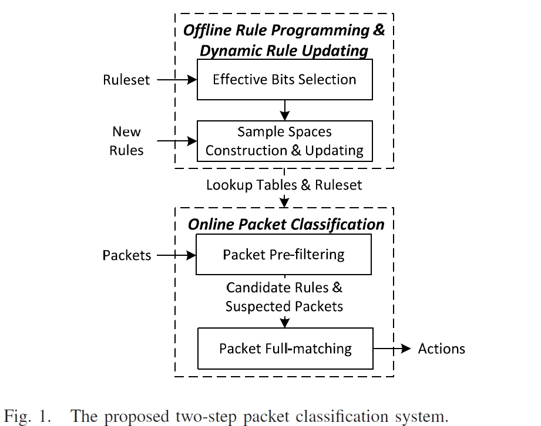

# 大綱
* * *
封包分類是SDN switch中一個重要的function，因為openflow switch會檢視大約15個欄位並與上千個規則配對。
如果header的欄位增生就很難設計出表現良好的演算法，此論文提出一個具有擴展性的演算法可以藉由多個欄位(field)來將封包做分類，並將原型實作在GPU上。
  
此演算法利用ruleset的稀疏性，藉由少量的**effective bits(EB)**來分割大型的ruleset成多個subsets，並且只有低重複性。
  
SDN為了追求系粒度的控制，所以相較於傳統網路的檢查5個欄位，sdn的Switch可能會檢查到多達45欄位並且包含15個必要的欄位。
  
一般來說目前的解法有硬體跟軟體，硬體的部分就是使用TCAM，他可以透過平行搜索來增加它的throughput。另外軟體部分，以演算法來解決的有decision-tree-based、decomposition-based，以及使用orthogonal原理的prefix probability以及entropy的方式。
  
但若是更多欄位的情況使用這些演算法，像是以Decision tree based的方式就會造成產生出太深跟太廣的Tree，而造成大量的記憶體浪費跟tree traversal的時候的不便利。
  
目前的新研究主要透過，避免相同的封包在不同的network node被重複的分類，像是使用tagging的方法(在edge switch中分類並加入tag做fast packet forwarding)
* * *
此論文使用selective bit-concatenation (MC-SBC)來作為封包分類的演算法，MC-SBC使用鬆散的ruleset來找出effective bits，並使用EB來分割大的ruleset成為小的subset，且只有少數的rule replication。
  
簡單來說，他們會對rule跟packet做採樣用來封包快速處理，而rule的樣本會拿去用來將rule id對應樣本空間(packet)，來做為初步的封包分類結果。
 
而初步的分類結果就會被存在**lookup table**，若要找回這些結果要用接下來的packet的sample value做為訪問lookup table的index。
 
而MC-SBC就可以使用這些sample values來快速的從不需要完全matched的大部分rules中過濾。
- - -

分為Offline Online兩大區塊
Offline主要就是先處理ruleset的部分，而Online就是當packet經過switch的時候要做的classification部分
首先先講offline這邊，offline最一開始會先讀取ruleset進來，然後會利用ruleset的疏密性來找出eb
之後就可以透過eb來將ruleset切割為多個subset又稱為sample space，此時如果有新的rule近來也可以進行更新，然後產出一個look up table
再來有封包近來switch的話就可以先使用lookup table來進行prefiltering，先從大量ruleset中快速過濾出幾個疑似的rule，最後使用那個封包與那些rule進行full matching
去一一比對欄位，最後就執行最後match的rule的動作

